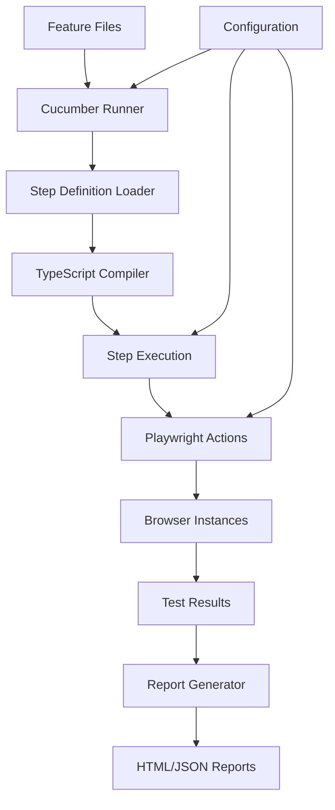

# BDD Test Infrastructure Architecture
## Founders Day Monorepo

## System Overview
```
System Name: BDD Test Infrastructure
Description: TypeScript-based Cucumber BDD test framework with Playwright for the Founders Day monorepo
Key Components: 
  - Cucumber Test Runner
  - TypeScript Step Definitions
  - Playwright Browser Automation
  - Parallel Execution Engine
  - Report Generation System
Design Patterns:
  - Page Object Model
  - Step Definition Reusability
  - Configuration as Code
  - Monorepo Package Sharing
```

## Component Architecture

### 1. Test Runner Component
```
Name: Cucumber Test Runner
Responsibility: Orchestrate test execution and manage test lifecycle
Interfaces:
  - CLI commands for test execution
  - Configuration file parsing
  - Feature file discovery
  - Step definition loading
Dependencies:
  - @cucumber/cucumber
  - ts-node for TypeScript execution
  - Configuration files
Data Flow:
  - Input: Feature files, step definitions, configuration
  - Output: Test results, reports, exit codes
```

### 2. Step Definitions Component
```
Name: TypeScript Step Definitions
Responsibility: Map Gherkin steps to executable code
Structure:
  /features/step-definitions/
    /common/
      - setup-steps.ts
      - ui-steps.ts
      - form-steps.ts
    - navigation-steps.ts
    - profile-steps.ts
    - search-steps.ts
Dependencies:
  - Playwright for browser automation
  - Shared utilities
  - Page objects
Data Flow:
  - Input: Gherkin step text and parameters
  - Output: Test execution results
```

### 3. Browser Automation Component
```
Name: Playwright Integration
Responsibility: Control browser instances and perform UI actions
Interfaces:
  - Browser launch and management
  - Page navigation and interaction
  - Element selection and manipulation
  - Screenshot and video capture
Dependencies:
  - @playwright/test
  - Browser binaries
Configuration:
  - Browser types (Chromium, Firefox, WebKit)
  - Headless/headed mode
  - Viewport sizes
  - Timeouts and retries
```

### 4. Configuration Management
```
Name: Test Configuration System
Responsibility: Manage environment-specific settings and test parameters
Files:
  - cucumber.js (main config)
  - cucumber.parallel.js (parallel execution)
  - tsconfig.json (TypeScript settings)
  - playwright.config.ts (browser settings)
Environment Variables:
  - TEST_ENV (dev/staging/prod)
  - PARALLEL_WORKERS (number of workers)
  - HEADLESS (true/false)
  - BASE_URL (application URL)
```

## Data Model

### Test Execution Model
```typescript
interface TestRun {
  id: string;
  timestamp: Date;
  features: Feature[];
  configuration: TestConfig;
  results: TestResults;
}

interface Feature {
  name: string;
  scenarios: Scenario[];
  tags: string[];
}

interface Scenario {
  name: string;
  steps: Step[];
  status: 'passed' | 'failed' | 'skipped';
  duration: number;
}

interface Step {
  text: string;
  status: 'passed' | 'failed' | 'skipped' | 'pending';
  error?: Error;
  screenshot?: string;
}
```

### Configuration Model
```typescript
interface TestConfig {
  parallel: boolean;
  workers: number;
  browsers: BrowserType[];
  baseUrl: string;
  timeout: number;
  retries: number;
  reports: ReportConfig[];
}

interface ReportConfig {
  type: 'html' | 'json' | 'junit';
  outputPath: string;
  includeScreenshots: boolean;
}
```

## Integration Points

### 1. Monorepo Integration
```
System: Lerna/Nx Monorepo
Protocol: File system and package management
Data Format: 
  - Shared TypeScript types
  - Common utilities
  - Shared configurations
Authentication: N/A (internal packages)
```

### 2. CI/CD Integration
```
System: GitHub Actions / Jenkins
Protocol: Command line interface
Data Format: 
  - Exit codes
  - JUnit XML reports
  - Console output
  - Artifact uploads
Authentication: CI/CD secrets and tokens
```

### 3. Application Under Test
```
System: Founders Day Frontend/Admin
Protocol: HTTP/HTTPS
Data Format: 
  - HTML/CSS/JavaScript
  - REST API responses
  - WebSocket messages
Authentication: Test user credentials
```

## Deployment Architecture

### Local Development
```
Environment: Developer machines
Setup:
  1. npm install at monorepo root
  2. TypeScript compilation
  3. Browser binary installation
  4. Local test execution
```

### CI/CD Pipeline
```
Environment: GitHub Actions runners
Stages:
  1. Checkout code
  2. Install dependencies
  3. Compile TypeScript
  4. Run tests in parallel
  5. Generate reports
  6. Upload artifacts
```

### Test Execution Flow


## Error Handling Strategy

### Compilation Errors
- Clear error messages with file paths
- TypeScript type checking before execution
- Source map support for debugging

### Runtime Errors
- Automatic retry mechanism
- Screenshot on failure
- Detailed error stack traces
- Video recording for debugging

### Infrastructure Errors
- Browser launch failures
- Network timeouts
- Missing dependencies
- Configuration errors

## Performance Optimization

### Parallel Execution
- Worker process pool
- Feature file distribution
- Isolated browser contexts
- Shared resource management

### Caching Strategy
- Browser binary caching
- Compiled TypeScript caching
- Test data caching
- Page object initialization

### Resource Management
- Browser instance pooling
- Memory limit monitoring
- Cleanup after test completion
- Graceful shutdown handling