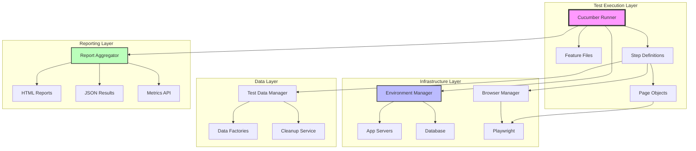

# BDD Test Infrastructure Architecture

## System Overview
- **System Name**: Founders Day BDD Test Suite
- **Description**: Comprehensive end-to-end testing framework using Cucumber and Playwright for behavior-driven testing
- **Key Components**: Test Runner, Step Definitions, Page Objects, Test Environment Manager, Report Generator
- **Design Patterns**: Page Object Model, Step Definition Library, Configuration Management, Parallel Execution

## Components

### 1. Test Environment Manager
- **Responsibility**: Manage application server lifecycle and readiness
- **Interfaces**: 
  - `startServer()`: Launch application servers
  - `waitForReady()`: Check server availability
  - `cleanup()`: Teardown test environment
- **Dependencies**: Node.js process management, HTTP health checks
- **Data Flow**: Environment config → Server startup → Health check → Test execution

### 2. Step Definition Registry
- **Responsibility**: Manage and resolve step definitions uniquely
- **Interfaces**:
  - `registerStep()`: Add new step definition with conflict detection
  - `findStep()`: Locate unique step implementation
  - `validateSteps()`: Check for ambiguity
- **Dependencies**: Cucumber framework, TypeScript decorators
- **Data Flow**: Feature files → Step matching → Implementation execution

### 3. Page Object Layer
- **Responsibility**: Encapsulate UI interactions and element locators
- **Interfaces**:
  - `BasePage`: Common page functionality
  - `LoginPage`, `ProfilePage`, etc.: Feature-specific pages
  - `MobileGestures`: Touch-specific interactions
- **Dependencies**: Playwright API, Element selectors
- **Data Flow**: Step definitions → Page methods → Browser actions

### 4. Test Data Manager
- **Responsibility**: Provide consistent test data across scenarios
- **Interfaces**:
  - `generateUser()`: Create test user data
  - `seedDatabase()`: Initialize test data
  - `cleanupData()`: Remove test artifacts
- **Dependencies**: Database connections, Data factories
- **Data Flow**: Test setup → Data creation → Test execution → Cleanup

### 5. Report Aggregator
- **Responsibility**: Collect and format test results
- **Interfaces**:
  - `collectResults()`: Gather test outcomes
  - `generateReport()`: Create HTML/JSON reports
  - `publishMetrics()`: Send data to monitoring
- **Dependencies**: Cucumber reporters, File system
- **Data Flow**: Test results → Aggregation → Report generation → Publishing

## Data Model

### Entities
- **TestRun**: Execution instance with timestamp, duration, status
- **Scenario**: Individual test case with steps and results
- **StepDefinition**: Reusable test step implementation
- **TestEnvironment**: Configuration and server details
- **TestData**: Generated data for test execution

### Relationships
- TestRun → many Scenarios
- Scenario → many Steps
- StepDefinition → many Steps
- TestEnvironment → many TestRuns
- TestData → many Scenarios

### Storage Strategy
- **Configuration**: JSON files in `/config`
- **Test Results**: JSON/HTML in `/reports`
- **Screenshots**: PNG files in `/screenshots`
- **Logs**: Text files in `/logs`
- **Metrics**: Time-series data for performance tracking

## Integration Points

### 1. Application Server
- **System**: Founders Day Frontend/Admin
- **Protocol**: HTTP/HTTPS
- **Data Format**: REST API, HTML
- **Authentication**: Test user credentials

### 2. CI/CD Pipeline
- **System**: GitHub Actions
- **Protocol**: Process execution
- **Data Format**: Exit codes, JUnit XML
- **Authentication**: GitHub tokens

### 3. Browser Automation
- **System**: Playwright browsers
- **Protocol**: WebDriver protocol
- **Data Format**: DOM interactions
- **Authentication**: None (local execution)

### 4. Monitoring System
- **System**: Application metrics
- **Protocol**: HTTP POST
- **Data Format**: JSON metrics
- **Authentication**: API keys

## Deployment

### Environments
- **Local Development**: Developer machines
- **CI Environment**: GitHub Actions runners
- **Staging Tests**: Against staging servers
- **Production Smoke**: Limited production validation

### Scaling Strategy
- **Horizontal**: Parallel execution across multiple workers
- **Vertical**: Increased resources for browser instances
- **Sharding**: Split tests by feature/tag
- **Caching**: Reuse browser contexts where possible

### Monitoring
- **Test Execution Time**: Track scenario duration
- **Pass/Fail Rates**: Monitor test stability
- **Flaky Test Detection**: Identify intermittent failures
- **Resource Usage**: CPU/Memory consumption

### Backup & Recovery
- **Test Results**: Archived in cloud storage
- **Configuration**: Version controlled in Git
- **Test Data**: Regenerated per execution
- **Recovery**: Automatic retry for failed tests

## Architecture Diagram

## Key Architecture Decisions

1. **Playwright over Selenium**: Better performance, built-in waiting, modern API
2. **TypeScript**: Type safety for step definitions and page objects
3. **Parallel Execution**: Faster feedback with worker processes
4. **Page Object Pattern**: Maintainable UI interaction code
5. **Environment Isolation**: Each test run in clean state
6. **Comprehensive Reporting**: Multiple format outputs for different consumers