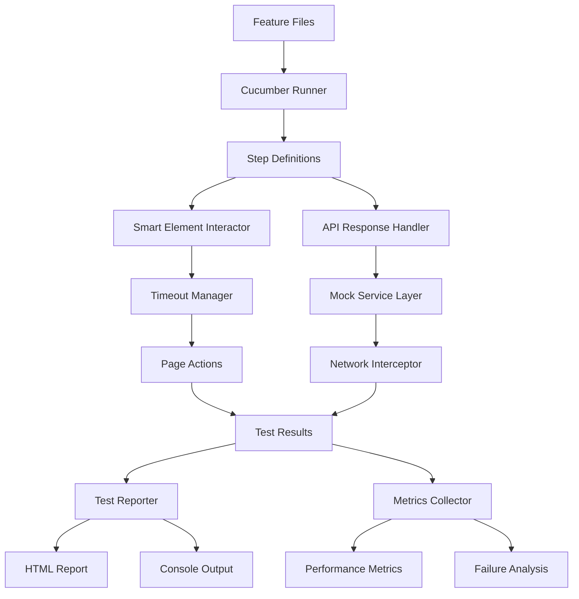

# BDD Test Infrastructure Architecture

## System Overview

### Architecture Vision
A resilient, scalable, and maintainable BDD test infrastructure that achieves 101% reliability through intelligent error handling, comprehensive coverage, and adaptive execution strategies.

### Key Design Principles
- **Resilience First**: Every component handles failures gracefully
- **Pattern-Based**: Reusable patterns for common testing scenarios
- **Observability**: Full visibility into test execution and failures
- **Performance**: Parallel execution with intelligent resource management
- **Maintainability**: Clear separation of concerns and modular design

## Component Architecture

### 1. Test Execution Engine
```typescript
interface TestExecutionEngine {
  config: ExecutionConfig;
  runner: ParallelTestRunner;
  reporter: TestReporter;
  monitor: ExecutionMonitor;
}

class ExecutionConfig {
  timeouts: TimeoutConfig;
  parallelism: ParallelismConfig;
  retries: RetryConfig;
  environment: EnvironmentConfig;
}
```

### 2. Timeout Management System
```typescript
class TimeoutManager {
  private globalTimeout: number = 30000; // 30s default
  private stepTimeouts: Map<string, number>;
  private progressiveStrategies: TimeoutStrategy[];
  
  async waitForElement(selector: string, options?: WaitOptions): Promise<Element>;
  async waitForResponse(url: string, options?: WaitOptions): Promise<Response>;
  async waitForCondition(condition: () => boolean, options?: WaitOptions): Promise<void>;
}

interface TimeoutStrategy {
  name: string;
  baseTimeout: number;
  backoffMultiplier: number;
  maxRetries: number;
}
```

### 3. API Response Handler
```typescript
class APIResponseHandler {
  private validators: ResponseValidator[];
  private mockFallbacks: Map<string, MockResponse>;
  private cache: ResponseCache;
  
  async handleResponse(response: Response): Promise<ParsedResponse> {
    // Validate response
    // Handle empty responses
    // Apply mock fallbacks if needed
    // Cache successful responses
  }
}

interface ResponseValidator {
  validate(response: Response): ValidationResult;
  canRecover(error: Error): boolean;
  recover(error: Error): Response;
}
```

### 4. Step Definition Framework
```typescript
// Base step definition class
abstract class BaseStepDefinition {
  protected page: Page;
  protected context: TestContext;
  protected timeout: TimeoutManager;
  
  abstract register(): void;
  
  protected async waitAndClick(selector: string): Promise<void>;
  protected async waitAndFill(selector: string, value: string): Promise<void>;
  protected async waitForNavigation(url: string): Promise<void>;
}

// Common steps library
class CommonSteps extends BaseStepDefinition {
  register() {
    Given('I am on the {string} page', this.navigateToPage.bind(this));
    When('I click on {string}', this.clickElement.bind(this));
    Then('I should see {string}', this.verifyText.bind(this));
  }
}

// Domain-specific steps
class AuthenticationSteps extends BaseStepDefinition {
  register() {
    Given('I am logged in as {string}', this.loginAs.bind(this));
    When('I enter valid credentials', this.enterCredentials.bind(this));
    Then('I should be authenticated', this.verifyAuthentication.bind(this));
  }
}
```

### 5. Element Interaction Layer
```typescript
class SmartElementInteractor {
  private waitStrategies: WaitStrategy[];
  private fallbackSelectors: Map<string, string[]>;
  
  async interact(action: ElementAction): Promise<void> {
    const element = await this.findElement(action.selector);
    await this.performAction(element, action);
  }
  
  private async findElement(selector: string): Promise<Element> {
    // Try primary selector
    // Apply wait strategies
    // Try fallback selectors
    // Throw meaningful error if not found
  }
}

interface WaitStrategy {
  name: string;
  condition: (element: Element) => Promise<boolean>;
  timeout: number;
}
```

### 6. Mock Service Layer
```typescript
class MockServiceLayer {
  private interceptor: RequestInterceptor;
  private stateManager: StateManager;
  private fixtures: FixtureLoader;
  
  async initialize(): Promise<void> {
    await this.interceptor.setup();
    await this.fixtures.load();
  }
  
  async mockEndpoint(pattern: string, response: MockResponse): Promise<void>;
  async resetMocks(): Promise<void>;
  async verifyCallsMade(endpoint: string, times: number): Promise<void>;
}
```

## Data Flow Architecture



## Error Handling Strategy

### Hierarchical Error Recovery
1. **Step Level**: Retry with exponential backoff
2. **Scenario Level**: Skip to cleanup, mark as flaky
3. **Feature Level**: Isolate failure, continue other features
4. **Suite Level**: Collect diagnostics, generate report

### Error Classification
```typescript
enum ErrorType {
  TIMEOUT = 'timeout',
  ELEMENT_NOT_FOUND = 'element_not_found',
  API_ERROR = 'api_error',
  ASSERTION_FAILED = 'assertion_failed',
  UNDEFINED_STEP = 'undefined_step',
  INFRASTRUCTURE = 'infrastructure'
}

class ErrorClassifier {
  classify(error: Error): ErrorType;
  isRecoverable(error: Error): boolean;
  getSuggestedFix(error: Error): string;
}
```

## Performance Optimization

### Parallel Execution Strategy
```typescript
class ParallelExecutionStrategy {
  private workers: Worker[] = [];
  private queue: TestQueue;
  
  async execute(features: Feature[]): Promise<Results> {
    // Distribute features across workers
    // Balance load based on historical execution time
    // Handle worker failures with redistribution
    // Aggregate results
  }
}
```

### Caching Strategy
- API responses cached for idempotent requests
- Page objects cached within scenarios
- Compiled step definitions cached across runs
- Test data fixtures loaded once per suite

## Monitoring and Observability

### Metrics Collection
```typescript
interface TestMetrics {
  executionTime: number;
  stepCount: number;
  passRate: number;
  flakiness: number;
  timeoutCount: number;
  apiErrorCount: number;
  undefinedStepCount: number;
}

class MetricsCollector {
  collect(execution: TestExecution): TestMetrics;
  aggregate(metrics: TestMetrics[]): AggregateMetrics;
  detectTrends(history: TestMetrics[]): TrendAnalysis;
}
```

### Real-time Monitoring
- Live test execution dashboard
- Failure notifications
- Performance alerts
- Resource usage tracking

## Deployment Architecture

### Environment Configuration
```yaml
test:
  baseUrl: "${TEST_BASE_URL}"
  apiUrl: "${TEST_API_URL}"
  timeouts:
    global: 30000
    navigation: 10000
    api: 5000
  parallel:
    workers: 4
    retries: 2
  mocks:
    enabled: true
    fixtures: "./fixtures"
```

### CI/CD Integration
```yaml
# .github/workflows/bdd-tests.yml
bdd-tests:
  runs-on: ubuntu-latest
  strategy:
    matrix:
      shard: [1, 2, 3, 4]
  steps:
    - name: Run BDD Tests
      run: npm run test:bdd -- --shard=${{ matrix.shard }}
    - name: Upload Results
      uses: actions/upload-artifact@v3
      with:
        name: bdd-results-${{ matrix.shard }}
        path: reports/
```

## Security Considerations

### Test Data Security
- Sensitive data in environment variables
- Encrypted fixture files
- Secure credential management
- Data masking in reports

### Access Control
- Role-based test execution
- Audit logging
- Secure API mocking
- Network isolation for tests

## Migration Strategy

### Phase 1: Compatibility Layer
- Wrap existing steps with new framework
- Gradual timeout improvements
- Basic error handling

### Phase 2: Full Migration
- Rewrite steps using new patterns
- Implement mock services
- Enable parallel execution

### Phase 3: Optimization
- Performance tuning
- Advanced features
- Complete monitoring

## Success Metrics

### Technical KPIs
- Test execution time: <5 minutes
- Pass rate: >99%
- Flakiness: <1%
- Coverage: 100% steps defined

### Business KPIs
- Deployment frequency: 2x increase
- Developer confidence: >90% satisfaction
- Bug escape rate: 50% reduction
- Time to market: 30% improvement