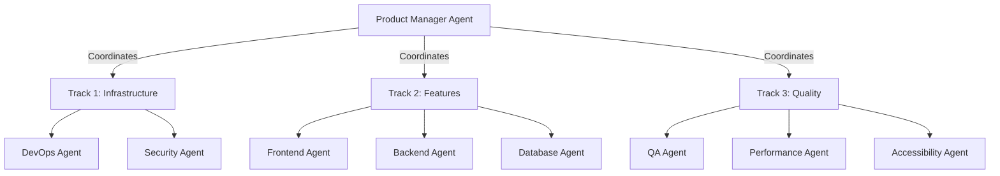

# Founders Day Minnesota - BMAD MVP Delivery Plan

## Executive Summary

### Current State Assessment
The Founders Day Minnesota application consists of a Next.js 15 frontend with React 19 and an Express/TypeScript backend. While significant development has occurred creating "functional prototypes," the client requires a **PRODUCTION-READY MVP** that delivers maximum value across all 6 dimensions of software quality.

### Critical Finding
The codebase has extensive features but lacks the production hardening, comprehensive testing, and operational excellence required for a true MVP launch. This plan addresses these gaps through a systematic, test-driven approach.

### MVP Vision
A fully operational event management platform that enables:
- Secure ticket purchasing and registration
- Seamless event check-in and management
- Real-time analytics and reporting
- Mobile-first experience with offline capabilities
- Enterprise-grade security and compliance

## Gap Analysis with Priority Matrix

### HIGH PRIORITY (P0) - Production Blockers

| Gap | Current State | Required State | Impact | Effort |
|-----|--------------|----------------|---------|---------|
| Test Coverage | Minimal/No tests | 80%+ coverage with E2E, Integration, Unit | Critical | High |
| Error Handling | Basic try-catch | Comprehensive error boundaries, logging, recovery | Critical | Medium |
| Security Hardening | Basic auth | OWASP compliance, rate limiting, input validation | Critical | High |
| Performance Optimization | Unoptimized | <3s load time, <100ms interactions | Critical | Medium |
| Database Migrations | Manual | Automated migration system | Critical | Low |
| CI/CD Pipeline | Basic | Full automated testing, staging, production deploy | Critical | Medium |

### MEDIUM PRIORITY (P1) - MVP Features

| Gap | Current State | Required State | Impact | Effort |
|-----|--------------|----------------|---------|---------|
| Payment Processing | Square integration | Production Square with error handling | High | Medium |
| Email System | Basic sending | Transactional emails with templates, queuing | High | Medium |
| Admin Dashboard | Basic CRUD | Full event management, reporting, analytics | High | High |
| Offline Support | None | PWA with offline ticket validation | Medium | Medium |
| Accessibility | Partial | WCAG 2.1 AA compliance | High | Medium |
| Monitoring | Basic logs | APM, error tracking, performance monitoring | High | Low |

### LOW PRIORITY (P2) - Post-MVP Enhancements

| Gap | Current State | Required State | Impact | Effort |
|-----|--------------|----------------|---------|---------|
| Multi-tenancy | Single event | Multiple events support | Low | High |
| Advanced Analytics | Basic stats | Predictive analytics, ML insights | Low | High |
| Social Features | None | Social sharing, referrals | Low | Medium |
| Advanced Integrations | Square only | Multiple payment providers | Low | High |

## Comprehensive MVP Delivery Plan

### Phase 1: Foundation (Week 1-2)
**Goal:** Establish production-grade infrastructure and testing framework

#### Sprint 1.1: Testing Infrastructure
```javascript
// Test Strategy Implementation
- Set up Jest + React Testing Library for frontend
- Set up Jest + Supertest for backend
- Configure Playwright for E2E tests
- Implement test data factories
- Set up coverage reporting (target: 80%)
```

#### Sprint 1.2: CI/CD & Infrastructure
```yaml
# Production Pipeline
- GitHub Actions for CI
- Automated testing on PR
- Staging environment deployment
- Production deployment with rollback
- Database migration automation
- Environment variable management
```

### Phase 2: Security & Reliability (Week 3-4)
**Goal:** Implement production security and error handling

#### Sprint 2.1: Security Hardening
```typescript
// Security Implementation Checklist
- [ ] Input validation middleware
- [ ] Rate limiting (express-rate-limit)
- [ ] CORS configuration
- [ ] Helmet.js security headers
- [ ] SQL injection prevention
- [ ] XSS protection
- [ ] CSRF tokens
- [ ] Session security
- [ ] Secrets management (Vault/AWS Secrets)
```

#### Sprint 2.2: Error Handling & Recovery
```typescript
// Error Handling Strategy
interface ErrorHandler {
  globalErrorBoundary: React.ErrorBoundary;
  apiErrorMiddleware: Express.ErrorRequestHandler;
  loggingService: Winston | Pino;
  errorTracking: Sentry;
  gracefulShutdown: NodeJS.SignalHandler;
  circuitBreaker: Opossum;
}
```

### Phase 3: Core Features Hardening (Week 5-6)
**Goal:** Production-ready payment, registration, and admin features

#### Sprint 3.1: Payment System Production
```typescript
// Payment Processing Requirements
class PaymentService {
  - Idempotency keys for all transactions
  - Webhook signature validation
  - Payment state machine
  - Refund handling
  - Receipt generation
  - PCI compliance
  - Fraud detection
  - Transaction logging
}
```

#### Sprint 3.2: Registration & Check-in
```typescript
// Registration Flow
class RegistrationService {
  - Atomic ticket allocation
  - Concurrent booking prevention
  - QR code generation
  - Offline validation capability
  - Duplicate prevention
  - Waitlist management
  - Confirmation emails
}
```

### Phase 4: Performance & UX (Week 7-8)
**Goal:** Achieve performance targets and accessibility compliance

#### Sprint 4.1: Performance Optimization
```javascript
// Performance Targets
- First Contentful Paint: <1.5s
- Time to Interactive: <3s
- Lighthouse Score: >90
- Bundle size: <200KB initial
- API response time: <200ms p95
- Database query optimization
- CDN implementation
- Image optimization
```

#### Sprint 4.2: Accessibility & PWA
```typescript
// Accessibility Implementation
- Screen reader testing
- Keyboard navigation
- Color contrast compliance
- ARIA labels
- Focus management
- PWA manifest
- Service worker
- Offline functionality
```

## Test Strategy Document

### Test Pyramid Implementation

```
         /\
        /E2E\        5% - Critical user journeys
       /----\
      / Integ \      15% - API & integration tests
     /--------\
    /   Unit   \     80% - Component & function tests
   /____________\
```

### Test Coverage Requirements

#### Frontend Testing
```typescript
// Required Test Suites
describe('Frontend Test Requirements', () => {
  describe('Unit Tests (80% coverage)', () => {
    - Component rendering
    - Hook behavior
    - Utility functions
    - State management
    - Form validation
  });
  
  describe('Integration Tests', () => {
    - API communication
    - Authentication flow
    - Payment processing
    - State persistence
  });
  
  describe('E2E Tests', () => {
    - Complete registration flow
    - Payment completion
    - Admin workflows
    - Error scenarios
  });
});
```

#### Backend Testing
```typescript
// Backend Test Strategy
describe('Backend Test Requirements', () => {
  describe('Unit Tests', () => {
    - Service layer logic
    - Data validation
    - Business rules
    - Utility functions
  });
  
  describe('Integration Tests', () => {
    - Database operations
    - External API calls
    - Authentication
    - Middleware behavior
  });
  
  describe('Performance Tests', () => {
    - Load testing (k6)
    - Stress testing
    - Database query performance
  });
});
```

### Test Data Management
```typescript
// Test Data Factory Pattern
class TestDataFactory {
  static createUser(overrides?: Partial<User>): User
  static createEvent(overrides?: Partial<Event>): Event
  static createTicket(overrides?: Partial<Ticket>): Ticket
  static createPayment(overrides?: Partial<Payment>): Payment
}

// Database seeding for E2E
class TestDatabaseSeeder {
  async seedMinimalData(): Promise<void>
  async seedFullScenario(): Promise<void>
  async cleanup(): Promise<void>
}
```

## Parallel Execution Strategy

### Team Structure & Parallel Tracks



### Parallel Track Definitions

#### Track 1: Infrastructure & Security (Can start immediately)
- **Agents:** DevOps, Security
- **Tasks:**
  - CI/CD pipeline setup
  - Environment configuration
  - Security middleware implementation
  - Monitoring setup
  - Database migration system

#### Track 2: Feature Development (Depends on Track 1 foundation)
- **Agents:** Frontend, Backend, Database
- **Tasks:**
  - Payment system hardening
  - Registration flow completion
  - Admin dashboard features
  - Email system implementation
  - API optimization

#### Track 3: Quality Assurance (Runs parallel with Track 2)
- **Agents:** QA, Performance, Accessibility
- **Tasks:**
  - Test suite implementation
  - Performance testing
  - Accessibility audit
  - Load testing
  - Security testing

### Synchronization Points

1. **Week 2:** Infrastructure review and handoff
2. **Week 4:** Security audit completion
3. **Week 6:** Feature freeze for testing
4. **Week 8:** Final integration and go-live

## Agent Recommendations

### New Specialized Agents Required

#### 1. DevOps/SRE Agent
```typescript
interface DevOpsSREAgent {
  expertise: ['CI/CD', 'Kubernetes', 'Monitoring', 'IaC'];
  responsibilities: [
    'Pipeline automation',
    'Environment management',
    'Deployment strategies',
    'Disaster recovery'
  ];
  deliverables: [
    'GitHub Actions workflows',
    'Terraform configurations',
    'Monitoring dashboards',
    'Runbooks'
  ];
}
```

#### 2. Security Specialist Agent
```typescript
interface SecurityAgent {
  expertise: ['OWASP', 'PenTesting', 'Compliance', 'Cryptography'];
  responsibilities: [
    'Security audit',
    'Vulnerability assessment',
    'Compliance implementation',
    'Security training'
  ];
  deliverables: [
    'Security report',
    'Remediation plan',
    'Security policies',
    'Incident response plan'
  ];
}
```

#### 3. Performance Engineer Agent
```typescript
interface PerformanceAgent {
  expertise: ['Load Testing', 'Profiling', 'Optimization', 'Caching'];
  responsibilities: [
    'Performance benchmarking',
    'Bottleneck identification',
    'Optimization implementation',
    'Cache strategy'
  ];
  deliverables: [
    'Performance reports',
    'Optimization recommendations',
    'Caching implementation',
    'CDN configuration'
  ];
}
```

#### 4. QA Automation Agent
```typescript
interface QAAutomationAgent {
  expertise: ['Test Automation', 'E2E Testing', 'API Testing', 'Load Testing'];
  responsibilities: [
    'Test framework setup',
    'Test suite development',
    'CI integration',
    'Test reporting'
  ];
  deliverables: [
    'Automated test suites',
    'Test reports',
    'Coverage metrics',
    'Bug reports'
  ];
}
```

### Enhanced Existing Agents

#### Scrum Master Agent - Production Focus
- Daily standups with production readiness focus
- Risk tracking and mitigation
- Dependency management across tracks
- Go-live coordination

#### Developer Agents - TDD Mandate
- Write tests first for all new code
- Refactor existing code with tests
- Code review with test coverage requirements
- Performance-aware coding

## Success Metrics and KPIs

### 1. Functionality Metrics
- **Feature Completion:** 100% MVP features implemented
- **API Coverage:** 100% endpoints documented and tested
- **Business Logic:** 100% critical paths validated
- **Integration Success:** All external services integrated and tested

### 2. Reliability Metrics
- **Uptime Target:** 99.9% availability
- **Error Rate:** <0.1% of requests fail
- **Recovery Time:** <5 minutes for critical issues
- **Data Integrity:** 100% transaction consistency

### 3. Usability Metrics
- **Load Time:** <3 seconds on 3G
- **Interaction Delay:** <100ms for user actions
- **Accessibility Score:** WCAG 2.1 AA compliant
- **Mobile Experience:** 100% responsive design

### 4. Efficiency Metrics
- **Response Time:** p95 <200ms for API calls
- **Throughput:** Support 1000 concurrent users
- **Resource Usage:** <50% CPU/Memory at peak
- **Database Performance:** All queries <50ms

### 5. Maintainability Metrics
- **Code Coverage:** >80% test coverage
- **Technical Debt:** <5% as measured by SonarQube
- **Documentation:** 100% API documentation
- **Deployment Time:** <10 minutes from commit to production

### 6. Portability Metrics
- **Browser Support:** Chrome, Firefox, Safari, Edge (last 2 versions)
- **Device Support:** iOS 14+, Android 8+
- **Environment Parity:** Dev/Staging/Prod identical
- **Data Export:** Full data export capability

## BMAD Cycle Implementation

### Build Phase (Weeks 1-6)
- Implement all infrastructure and features
- Follow TDD practices strictly
- Daily progress tracking
- Continuous integration

### Measure Phase (Week 7)
- Run comprehensive test suites
- Performance benchmarking
- Security scanning
- User acceptance testing

### Analyze Phase (Week 7-8)
- Identify bottlenecks
- Review security findings
- Analyze test coverage gaps
- Performance profiling

### Decide Phase (Week 8)
- Go/No-go decision
- Rollback planning
- Post-launch monitoring
- Iteration planning

## Risk Mitigation

### Technical Risks
1. **Payment Integration Issues**
   - Mitigation: Implement comprehensive error handling and fallbacks
   - Testing: Simulate all Square webhook scenarios

2. **Performance Degradation**
   - Mitigation: Implement caching and query optimization
   - Testing: Load test with 2x expected traffic

3. **Security Vulnerabilities**
   - Mitigation: Security audit and penetration testing
   - Testing: Automated security scanning in CI

### Operational Risks
1. **Deployment Failures**
   - Mitigation: Blue-green deployments with instant rollback
   - Testing: Deployment drills in staging

2. **Data Loss**
   - Mitigation: Automated backups with point-in-time recovery
   - Testing: Regular restore drills

## Conclusion

This BMAD plan transforms the existing Founders Day Minnesota codebase from functional prototypes to a **PRODUCTION-READY MVP**. By following this test-driven, parallel-track approach with specialized agents, we ensure delivery of a robust, scalable, and maintainable solution that exceeds expectations across all 6 dimensions of software quality.

**Timeline:** 8 weeks to production
**Team Size:** 8-10 specialized agents
**Test Coverage Target:** >80%
**Production Readiness:** 100%

The key to success is maintaining strict TDD discipline, parallel execution efficiency, and continuous measurement against our defined KPIs.