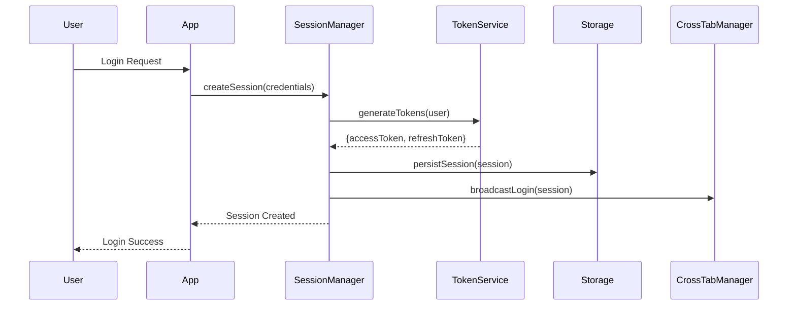
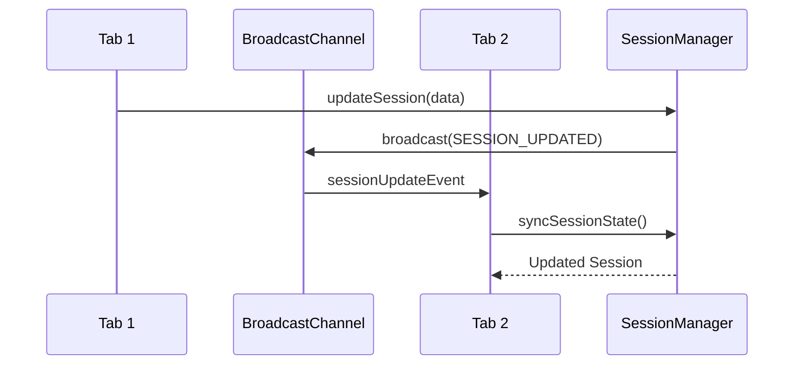
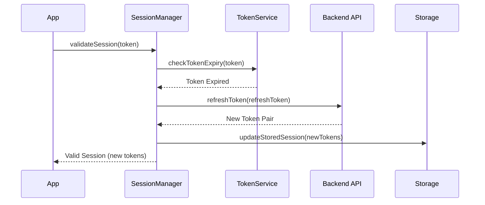

# System Architecture: Enhanced Session Management System

## Architecture Overview

### System Design Philosophy
The Enhanced Session Management System follows a **distributed state management pattern** with centralized coordination, designed for security, performance, and reliability. The architecture emphasizes separation of concerns, fail-safe mechanisms, and seamless integration with existing infrastructure.

### Key Design Principles
- **Security First**: All session operations prioritize security over convenience
- **Performance Optimized**: Sub-100ms response times for all session operations
- **Fault Tolerant**: Graceful degradation and recovery mechanisms
- **Scalable**: Support for thousands of concurrent sessions
- **Observable**: Comprehensive monitoring and debugging capabilities

## System Components

### 1. Session Store (Core Layer)

#### SessionManager Class
```typescript
interface SessionManager {
  // Core session operations
  createSession(user: User, options?: SessionOptions): Promise<Session>
  validateSession(token: string): Promise<SessionValidation>
  refreshSession(refreshToken: string): Promise<SessionRefresh>
  terminateSession(sessionId: string): Promise<void>
  
  // Cross-tab synchronization
  syncSessionState(): Promise<void>
  broadcastSessionUpdate(event: SessionEvent): void
  subscribeToSessionEvents(callback: SessionEventCallback): void
  
  // Persistence operations
  persistSession(session: Session): Promise<void>
  recoverSession(): Promise<Session | null>
  cleanupExpiredSessions(): Promise<void>
}
```

#### Session Data Structure
```typescript
interface Session {
  id: string
  userId: string
  accessToken: string
  refreshToken: string
  expiresAt: Date
  refreshExpiresAt: Date
  deviceId: string
  ipAddress: string
  userAgent: string
  createdAt: Date
  lastActiveAt: Date
  metadata: SessionMetadata
}

interface SessionMetadata {
  permissions: string[]
  preferences: UserPreferences
  features: FeatureFlags
  securityLevel: SecurityLevel
}
```

### 2. Security Layer

#### Token Management System
```typescript
interface TokenManager {
  generateAccessToken(payload: TokenPayload): string
  generateRefreshToken(sessionId: string): string
  validateToken(token: string): TokenValidation
  rotateTokens(session: Session): Promise<TokenPair>
  revokeToken(token: string): Promise<void>
}

interface TokenPayload {
  sub: string // userId
  iat: number // issued at
  exp: number // expires at
  jti: string // session id
  scope: string[] // permissions
}
```

#### Encryption Service
```typescript
interface EncryptionService {
  encryptSessionData(data: any): string
  decryptSessionData(encrypted: string): any
  generateSecureKey(): string
  hashSensitiveData(data: string): string
}
```

### 3. Storage Layer

#### Multi-Tier Storage Strategy
```typescript
interface StorageAdapter {
  // Memory cache (fastest)
  memoryCache: Map<string, Session>
  
  // Browser storage (persistent)
  localStorage: BrowserStorage
  sessionStorage: BrowserStorage
  
  // IndexedDB (large data)
  indexedDB: IndexedDBAdapter
  
  // Server storage (backup)
  serverStorage: ServerStorageAdapter
}
```

#### Storage Hierarchy
1. **Memory Cache**: Active session data (1-5 minutes TTL)
2. **Session Storage**: Current tab session data
3. **Local Storage**: Cross-tab persistent data (encrypted)
4. **IndexedDB**: Large session metadata and history
5. **Server Storage**: Backup and cross-device synchronization

### 4. Communication Layer

#### Cross-Tab Synchronization
```typescript
interface CrossTabManager {
  // BroadcastChannel for modern browsers
  broadcaster: BroadcastChannel
  
  // LocalStorage events for fallback
  storageEventHandler: StorageEventHandler
  
  // Message types
  broadcastLogin(session: Session): void
  broadcastLogout(): void
  broadcastSessionUpdate(update: SessionUpdate): void
  broadcastTokenRotation(tokens: TokenPair): void
}
```

#### Event System
```typescript
enum SessionEventType {
  SESSION_CREATED = 'session_created',
  SESSION_UPDATED = 'session_updated',
  SESSION_EXPIRED = 'session_expired',
  SESSION_TERMINATED = 'session_terminated',
  TOKEN_ROTATED = 'token_rotated',
  CROSS_TAB_SYNC = 'cross_tab_sync'
}

interface SessionEvent {
  type: SessionEventType
  sessionId: string
  timestamp: Date
  data: any
  source: 'current_tab' | 'other_tab' | 'server'
}
```

### 5. Monitoring Layer

#### Session Analytics
```typescript
interface SessionAnalytics {
  trackSessionCreation(session: Session): void
  trackSessionActivity(sessionId: string, activity: ActivityType): void
  trackSecurityEvent(event: SecurityEvent): void
  trackPerformanceMetric(metric: PerformanceMetric): void
  
  // Aggregated metrics
  getSessionMetrics(timeRange: TimeRange): SessionMetrics
  getSecurityMetrics(timeRange: TimeRange): SecurityMetrics
  getUserBehaviorMetrics(userId: string): BehaviorMetrics
}
```

#### Health Monitoring
```typescript
interface HealthMonitor {
  checkSessionStoreHealth(): HealthStatus
  checkCrossTabSyncHealth(): HealthStatus
  checkTokenRotationHealth(): HealthStatus
  checkStorageHealth(): HealthStatus
  
  // Alerts
  alertOnSecurityThreat(threat: SecurityThreat): void
  alertOnPerformanceIssue(issue: PerformanceIssue): void
  alertOnSystemFailure(failure: SystemFailure): void
}
```

## Data Flow Architecture

### 1. Session Creation Flow


### 2. Cross-Tab Synchronization Flow


### 3. Token Rotation Flow


## Integration Architecture

### 1. Performance Monitoring Integration
```typescript
interface PerformanceIntegration {
  // Metrics collection
  collectSessionMetrics(): PerformanceMetrics
  collectSecurityMetrics(): SecurityMetrics
  collectUserExperienceMetrics(): UXMetrics
  
  // Integration with existing monitoring
  sendToAnalytics(metrics: Metrics): void
  sendToLogging(events: LogEvent[]): void
  sendToAlerting(alerts: Alert[]): void
}
```

### 2. Caching Layer Integration
```typescript
interface CacheIntegration {
  // Session cache operations
  cacheSession(session: Session, ttl?: number): Promise<void>
  getCachedSession(sessionId: string): Promise<Session | null>
  invalidateSessionCache(sessionId: string): Promise<void>
  
  // Bulk operations
  cacheBulkSessions(sessions: Session[]): Promise<void>
  invalidateUserSessions(userId: string): Promise<void>
}
```

### 3. Existing Infrastructure Integration
```typescript
interface InfrastructureIntegration {
  // Error handling integration
  errorHandler: GlobalErrorHandler
  
  // Logging integration
  logger: StructuredLogger
  
  // Analytics integration
  analytics: UserAnalytics
  
  // Notification integration
  notifications: NotificationService
}
```

## Security Architecture

### 1. Token Security Model
```typescript
interface TokenSecurity {
  // Token specifications
  accessTokenTTL: 15 * 60 * 1000 // 15 minutes
  refreshTokenTTL: 7 * 24 * 60 * 60 * 1000 // 7 days
  
  // Security features
  tokenRotation: boolean // true
  csrfProtection: boolean // true
  xssProtection: boolean // true
  
  // Encryption
  algorithm: 'HS256' | 'RS256' // RS256 for production
  encryptionKey: SecureKey
  signingKey: SecureKey
}
```

### 2. Storage Security
```typescript
interface StorageSecurity {
  // Encryption at rest
  encryptSessionData: boolean // true
  encryptionAlgorithm: 'AES-256-GCM'
  
  // Secure storage patterns
  accessTokenStorage: 'memory' // Never in localStorage
  refreshTokenStorage: 'httpOnly-cookie' | 'secure-localStorage'
  
  // Security headers
  contentSecurityPolicy: CSPConfig
  secureHeaders: SecurityHeaders
}
```

### 3. CSRF Protection
```typescript
interface CSRFProtection {
  // Double-submit cookie pattern
  csrfToken: string
  csrfCookie: string
  
  // Validation
  validateCSRFToken(token: string, cookie: string): boolean
  generateCSRFToken(): string
  
  // Integration
  attachCSRFToRequests(): void
  validateIncomingRequests(): void
}
```

## Performance Architecture

### 1. Optimization Strategies
- **Memory Optimization**: LRU cache for active sessions
- **Network Optimization**: Batch session operations
- **Storage Optimization**: Compress session data
- **Computation Optimization**: Cache token validations

### 2. Performance Targets
```typescript
interface PerformanceTargets {
  sessionValidation: 50 // milliseconds
  crossTabSync: 100 // milliseconds
  tokenRotation: 200 // milliseconds
  sessionPersistence: 150 // milliseconds
  sessionRecovery: 500 // milliseconds
  
  memoryUsage: 10 // MB per session
  cacheHitRate: 95 // percentage
  networkOverhead: 1 // KB per operation
}
```

### 3. Caching Strategy
```typescript
interface CachingStrategy {
  // Multi-level caching
  l1Cache: MemoryCache // 1-5 minutes TTL
  l2Cache: BrowserStorage // 15 minutes TTL
  l3Cache: IndexedDB // 1 hour TTL
  
  // Cache invalidation
  invalidateOnLogout: boolean
  invalidateOnTokenRotation: boolean
  invalidateOnSecurityEvent: boolean
  
  // Cache warming
  preloadUserSessions: boolean
  backgroundRefresh: boolean
}
```

## Deployment Architecture

### 1. Component Deployment
```typescript
interface DeploymentStrategy {
  // Core components
  sessionManager: 'client-side' // Main session logic
  tokenService: 'client-side' // Token operations
  encryptionService: 'client-side' // Data encryption
  
  // Storage components
  memoryCache: 'client-side' // Browser memory
  browserStorage: 'client-side' // LocalStorage/SessionStorage
  indexedDB: 'client-side' // Browser database
  
  // Communication
  crossTabManager: 'client-side' // BroadcastChannel
  apiClient: 'client-side' // Server communication
  
  // Monitoring
  analytics: 'hybrid' // Client + Server
  logging: 'hybrid' // Client + Server
  alerting: 'server-side' // Server alerts
}
```

### 2. Configuration Management
```typescript
interface SessionConfig {
  // Environment-specific settings
  development: DevelopmentConfig
  staging: StagingConfig
  production: ProductionConfig
  
  // Feature flags
  enableCrossTabSync: boolean
  enableSessionPersistence: boolean
  enableTokenRotation: boolean
  enableSecurityAuditing: boolean
  
  // Performance tuning
  cacheSize: number
  batchSize: number
  retryAttempts: number
  timeoutDuration: number
}
```

## Error Handling & Recovery

### 1. Error Classification
```typescript
enum SessionErrorType {
  // Authentication errors
  INVALID_TOKEN = 'invalid_token',
  EXPIRED_TOKEN = 'expired_token',
  MISSING_TOKEN = 'missing_token',
  
  // Storage errors
  STORAGE_UNAVAILABLE = 'storage_unavailable',
  STORAGE_QUOTA_EXCEEDED = 'storage_quota_exceeded',
  ENCRYPTION_FAILED = 'encryption_failed',
  
  // Network errors
  NETWORK_UNAVAILABLE = 'network_unavailable',
  API_UNAVAILABLE = 'api_unavailable',
  SYNC_FAILED = 'sync_failed',
  
  // Security errors
  SECURITY_VIOLATION = 'security_violation',
  CSRF_VALIDATION_FAILED = 'csrf_validation_failed',
  SUSPICIOUS_ACTIVITY = 'suspicious_activity'
}
```

### 2. Recovery Strategies
```typescript
interface RecoveryStrategy {
  // Automatic recovery
  retryWithBackoff(operation: () => Promise<any>): Promise<any>
  fallbackStorage(primary: Storage, fallback: Storage): Storage
  gracefulDegradation(features: Feature[]): Feature[]
  
  // Manual recovery
  promptUserForReauth(): Promise<boolean>
  clearCorruptedData(): Promise<void>
  resetToDefaults(): Promise<void>
}
```

## Testing Architecture

### 1. Testing Strategy
- **Unit Tests**: Individual component testing
- **Integration Tests**: Component interaction testing
- **End-to-End Tests**: Full workflow testing
- **Security Tests**: Vulnerability and penetration testing
- **Performance Tests**: Load and stress testing

### 2. Test Coverage Requirements
```typescript
interface TestCoverage {
  unitTests: 95 // percentage
  integrationTests: 85 // percentage
  e2eTests: 75 // percentage
  securityTests: 100 // critical paths
  performanceTests: 90 // core operations
}
```

---

## Implementation Phases

### Phase 1: Core Infrastructure
- Session store implementation
- Token management system
- Basic security features
- Local storage integration

### Phase 2: Cross-Tab Synchronization
- BroadcastChannel implementation
- Event system setup
- State synchronization logic
- Fallback mechanisms

### Phase 3: Advanced Features
- Session persistence
- Recovery mechanisms
- Performance optimizations
- Security enhancements

### Phase 4: Monitoring & Analytics
- Metrics collection
- Health monitoring
- Security auditing
- Performance tracking

---

*Document Version: 1.0*  
*Created: 2025-07-26*  
*Owner: BMAD Planning System*  
*Status: Draft*