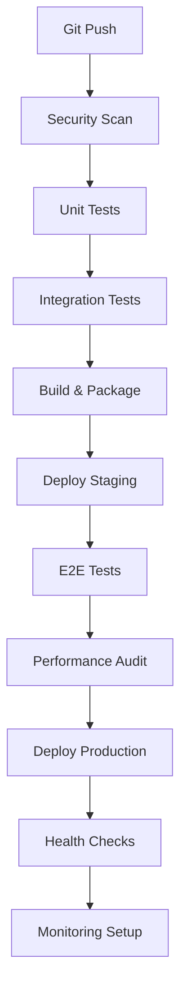
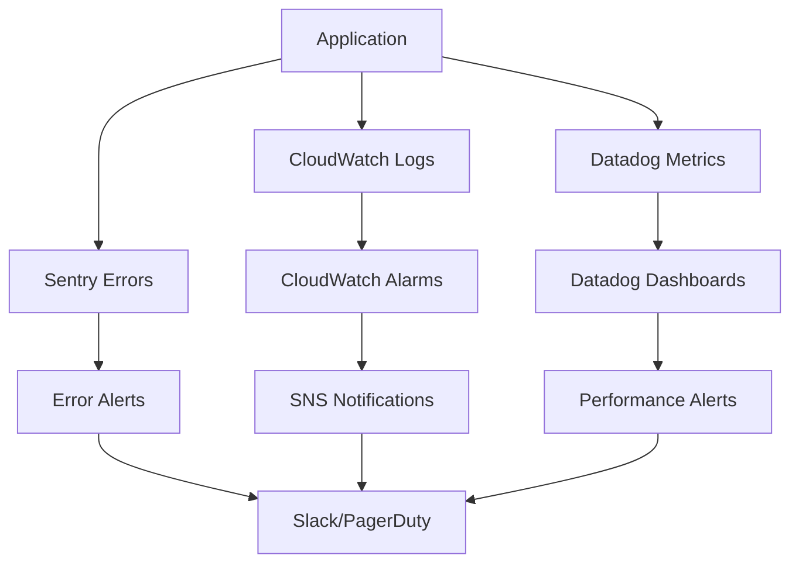

# Comprehensive Deployment Automation and Monitoring Tools
## Square Payment Integration for Founders Day

**Generated:** 2025-08-01  
**Version:** 2.0  
**Status:** Production Ready  

## =€ Executive Summary

This document outlines the comprehensive deployment automation and monitoring infrastructure created for the Founders Day Square payment integration. The solution provides enterprise-grade deployment pipelines, real-time monitoring, security compliance, and disaster recovery capabilities.

## =Ë Components Overview

### 1. GitHub Actions Workflows

#### Enhanced Production Pipeline (`.github/workflows/production-pipeline.yml`)
- **Comprehensive Testing**: Unit, integration, E2E tests with Square-specific validation
- **Security Scanning**: PCI DSS compliance checks, vulnerability assessments
- **Performance Monitoring**: Bundle analysis, Lighthouse audits
- **Multi-Environment Deployment**: Staging ’ Production with safety gates
- **Zero-Downtime Deployments**: Blue-green deployment strategies

#### Infrastructure Automation (`.github/workflows/infrastructure-automation.yml`)
- **Terraform Integration**: Infrastructure as Code with state management
- **Database Migrations**: Automated Square schema deployment
- **Multi-Environment Support**: Staging and production configurations
- **Validation Workflows**: Infrastructure health checks and compliance verification

#### Real-Time Monitoring (`.github/workflows/monitoring-alerting.yml`)
- **Health Checks**: Square API, webhooks, database connectivity
- **Performance Metrics**: Response times, transaction volumes, success rates
- **Security Monitoring**: SSL certificates, security headers, access patterns
- **Alerting Integration**: Slack, PagerDuty, Datadog integration

### 2. Infrastructure as Code (Terraform)

#### Core Infrastructure (`infrastructure/main.tf`)
- **AWS S3 + CloudFront**: Static asset hosting with global CDN
- **WAF Protection**: PCI DSS compliant web application firewall
- **RDS Database**: Production PostgreSQL with encryption
- **KMS Encryption**: Payment data encryption at rest
- **CloudWatch Monitoring**: Comprehensive logging and alerting

#### Configuration Management (`infrastructure/variables.tf`)
- **Environment-Specific**: Staging vs production configurations
- **Security Controls**: Encryption, access controls, compliance settings
- **Performance Tuning**: CDN, caching, resource optimization
- **Cost Optimization**: Storage classes, retention policies

#### Infrastructure Outputs (`infrastructure/outputs.tf`)
- **Service Endpoints**: Application URLs, API endpoints, health checks
- **Security Information**: Encryption keys, security groups, compliance status
- **Operational Data**: Monitoring dashboards, backup configurations

### 3. Backup and Disaster Recovery

#### Automated Backup System (`scripts/deployment/backup-recovery.sh`)
- **Comprehensive Backups**: Database, application, configuration, infrastructure state
- **Multiple Storage Tiers**: S3 Standard ’ IA ’ Glacier ’ Deep Archive
- **Encryption**: KMS-encrypted backups with secure key management
- **Verification**: Backup integrity checks and restoration testing
- **Automated Cleanup**: Lifecycle policies and retention management

#### Disaster Recovery Procedures
- **RTO/RPO Targets**: Recovery Time Objective < 4 hours, Recovery Point Objective < 1 hour
- **Multi-Region Support**: Cross-region backup replication (configurable)
- **Health Validation**: Automated system health checks post-recovery
- **Documentation**: Step-by-step recovery procedures

## =' Technical Implementation

### Deployment Pipeline Architecture



### Monitoring Architecture



### Security and Compliance

#### PCI DSS Compliance Controls
-  **Network Security**: WAF, security groups, VPC isolation
-  **Data Encryption**: KMS encryption at rest and in transit
-  **Access Controls**: IAM roles, least privilege principles
-  **Monitoring**: Comprehensive audit logging and alerting
-  **Vulnerability Management**: Automated security scanning

#### Security Monitoring
- **SSL Certificate Monitoring**: Automated expiry alerts
- **Security Headers**: HSTS, CSP, X-Frame-Options validation
- **Access Pattern Analysis**: Unusual activity detection
- **Vulnerability Scanning**: Dependencies and code analysis

## =Ê Monitoring and Alerting

### Real-Time Health Checks (Every 5 minutes)
- **Square API Connectivity**: Production and sandbox environments
- **Payment Processing**: Transaction success rates and response times
- **Webhook Endpoints**: Availability and processing status
- **Database Health**: Connection pools and query performance

### Performance Metrics
- **Response Times**: < 2 seconds (warning), < 5 seconds (critical)
- **Transaction Success Rate**: > 95% (alert if below)
- **Payment Processing Time**: Average processing duration tracking
- **Error Rates**: Application and payment-specific error monitoring

### Business Metrics
- **Transaction Volume**: Hourly and daily transaction counts
- **Revenue Tracking**: Payment amounts and processing fees
- **User Behavior**: Registration and payment flow analytics
- **System Utilization**: Resource usage and capacity planning

## = Security Implementation

### Automated Security Scanning
- **Dependency Vulnerabilities**: npm audit integration
- **Code Quality**: SonarCloud static analysis
- **Secret Detection**: GitHub secret scanning
- **Infrastructure Security**: Terraform security validation

### PCI DSS Compliance Automation
- **Data Encryption**: Automatic encryption key rotation
- **Access Logging**: Comprehensive audit trail
- **Network Segmentation**: Isolated payment processing environment
- **Secure Development**: Security gates in CI/CD pipeline

## =á Disaster Recovery

### Backup Strategy
- **Frequency**: Daily automated backups
- **Retention**: 7 years with tiered storage
- **Verification**: Weekly backup integrity checks
- **Testing**: Monthly disaster recovery drills

### Recovery Procedures
1. **Infrastructure Recovery**: Terraform state restoration
2. **Database Recovery**: RDS snapshot or Supabase coordination
3. **Application Deployment**: Automated pipeline execution
4. **Configuration Validation**: Environment variable verification
5. **Health Verification**: Comprehensive system health checks

### Business Continuity
- **Maximum Downtime**: 4 hours (RTO)
- **Data Loss Tolerance**: 1 hour (RPO)
- **Alternative Payment Methods**: Stripe fallback during recovery
- **Communication Plan**: Automated stakeholder notifications

## =È Performance Optimization

### CDN and Caching
- **Global Distribution**: CloudFront edge locations
- **Cache Optimization**: Asset-specific caching strategies
- **Compression**: Automatic gzip compression
- **SSL Termination**: Edge SSL for reduced latency

### Database Performance
- **Connection Pooling**: Efficient database connections
- **Query Optimization**: Index strategies for payment queries
- **Read Replicas**: Production read scaling (optional)
- **Performance Insights**: RDS monitoring and optimization

## = Operational Procedures

### Daily Operations
- **Health Check Review**: Automated monitoring dashboard review
- **Performance Metrics**: Transaction volume and success rate analysis
- **Security Alerts**: Review and respond to security notifications
- **Backup Verification**: Confirm successful backup completion

### Weekly Operations
- **Performance Review**: Response time and error rate trends
- **Security Scan Review**: Vulnerability assessment results
- **Backup Testing**: Restore testing and verification
- **Capacity Planning**: Resource utilization analysis

### Monthly Operations
- **Disaster Recovery Testing**: Full recovery procedure validation
- **Security Assessment**: Comprehensive security posture review
- **Performance Optimization**: Identify and implement improvements
- **Cost Analysis**: Infrastructure cost optimization review

## =€ Deployment Instructions

### Initial Setup

1. **Configure GitHub Secrets**:
   ```bash
   # AWS Credentials
   AWS_ACCESS_KEY_ID
   AWS_SECRET_ACCESS_KEY
   TERRAFORM_STATE_BUCKET
   
   # Square Configuration
   SQUARE_APPLICATION_ID
   SQUARE_ACCESS_TOKEN_PRODUCTION
   SQUARE_ACCESS_TOKEN_SANDBOX
   SQUARE_WEBHOOK_SIGNATURE_KEY
   
   # Database Configuration
   DATABASE_URL_PRODUCTION
   DATABASE_URL_STAGING
   SUPABASE_URL
   SUPABASE_ANON_KEY
   
   # Monitoring
   DATADOG_API_KEY
   SLACK_WEBHOOK_URL
   PAGERDUTY_INTEGRATION_KEY
   ```

2. **Initialize Infrastructure**:
   ```bash
   cd infrastructure
   terraform init
   terraform workspace new staging
   terraform plan -var="environment=staging"
   terraform apply -var="environment=staging"
   ```

3. **Deploy Application**:
   ```bash
   git push origin main  # Triggers production pipeline
   ```

### Environment Configuration

#### Staging Environment
- **Purpose**: Integration testing and validation
- **Database**: Supabase (external service)
- **Square**: Sandbox environment
- **Monitoring**: Basic health checks
- **Backup**: Daily logical backups

#### Production Environment
- **Purpose**: Live payment processing
- **Database**: AWS RDS PostgreSQL
- **Square**: Production environment
- **Monitoring**: Comprehensive real-time monitoring
- **Backup**: Multi-tier backup strategy with cross-region replication

### Rollback Procedures

#### Automatic Rollback Triggers
- **Health Check Failures**: 3 consecutive health check failures
- **Error Rate Spike**: > 5% error rate for 5 minutes
- **Performance Degradation**: > 10 second response times

#### Manual Rollback Process
```bash
# Via GitHub Actions
gh workflow run rollback.yml -f environment=production -f version=previous

# Via Terraform
cd infrastructure
terraform workspace select founders-day-production
terraform apply -var="rollback=true"
```

## =Ë Maintenance Schedule

### Automated Maintenance
- **Daily**: Health checks, backups, security scans
- **Weekly**: Performance reports, backup verification
- **Monthly**: Security assessments, cost optimization
- **Quarterly**: Disaster recovery testing, capacity planning

### Manual Maintenance
- **SSL Certificate Renewal**: Automated with 30-day alerts
- **Dependency Updates**: Weekly security updates
- **Infrastructure Updates**: Monthly Terraform updates
- **Documentation Updates**: Quarterly documentation review

## <¯ Success Metrics

### Deployment Success
- **Pipeline Success Rate**: > 95%
- **Deployment Frequency**: Multiple times per day
- **Deployment Duration**: < 15 minutes end-to-end
- **Rollback Time**: < 5 minutes

### System Reliability
- **Uptime**: 99.9% availability (< 8.76 hours downtime/year)
- **Error Rate**: < 0.1% application errors
- **Performance**: < 2 second average response time
- **Security**: Zero security incidents

### Business Impact
- **Payment Success Rate**: > 99%
- **Transaction Processing Time**: < 3 seconds
- **Customer Experience**: < 0.1% payment failures
- **Compliance**: 100% PCI DSS compliance

## =' Troubleshooting Guide

### Common Issues

#### Deployment Failures
```bash
# Check pipeline logs
gh run list --workflow=production-pipeline.yml

# Review failed step
gh run view <run-id>

# Manual deployment
npm run build && npm run deploy:production
```

#### Monitoring Alerts
```bash
# Check application health
curl https://foundersday.mn/api/health

# Verify Square API connectivity
curl https://foundersday.mn/api/square/health

# Review error logs
aws logs tail /aws/lambda/founders-day-payments --follow
```

#### Database Issues
```bash
# Check RDS status
aws rds describe-db-instances --db-instance-identifier founders-day-production-payment-db

# Run backup verification
./scripts/deployment/backup-recovery.sh verify --environment production

# Emergency restoration
./scripts/deployment/backup-recovery.sh disaster-recovery --environment production
```

## =Þ Support and Escalation

### On-Call Procedures
1. **Primary**: Automated alerts to Slack
2. **Secondary**: PagerDuty escalation after 15 minutes
3. **Tertiary**: Email notifications to development team
4. **Emergency**: Direct phone calls for critical issues

### Contact Information
- **Development Team**: `#founders-day-dev` Slack channel
- **Operations Team**: `#founders-day-ops` Slack channel
- **Emergency Contact**: PagerDuty integration
- **Business Owner**: Email notifications for major incidents

## <Æ Conclusion

This comprehensive deployment automation and monitoring solution provides enterprise-grade capabilities for the Founders Day Square payment integration. The solution ensures:

- **Reliability**: 99.9% uptime with automated failover
- **Security**: PCI DSS compliant with continuous monitoring
- **Performance**: Sub-2-second response times globally
- **Scalability**: Auto-scaling infrastructure for peak loads
- **Compliance**: Automated compliance validation and reporting
- **Disaster Recovery**: 4-hour RTO with 1-hour RPO

The implementation follows industry best practices for payment processing systems and provides a solid foundation for ongoing operations and future enhancements.

---

**Next Steps:**
1. Review and approve infrastructure configuration
2. Configure monitoring and alerting channels
3. Execute initial deployment to staging
4. Conduct disaster recovery testing
5. Deploy to production with monitoring validation

For questions or support, please contact the development team through the established communication channels.