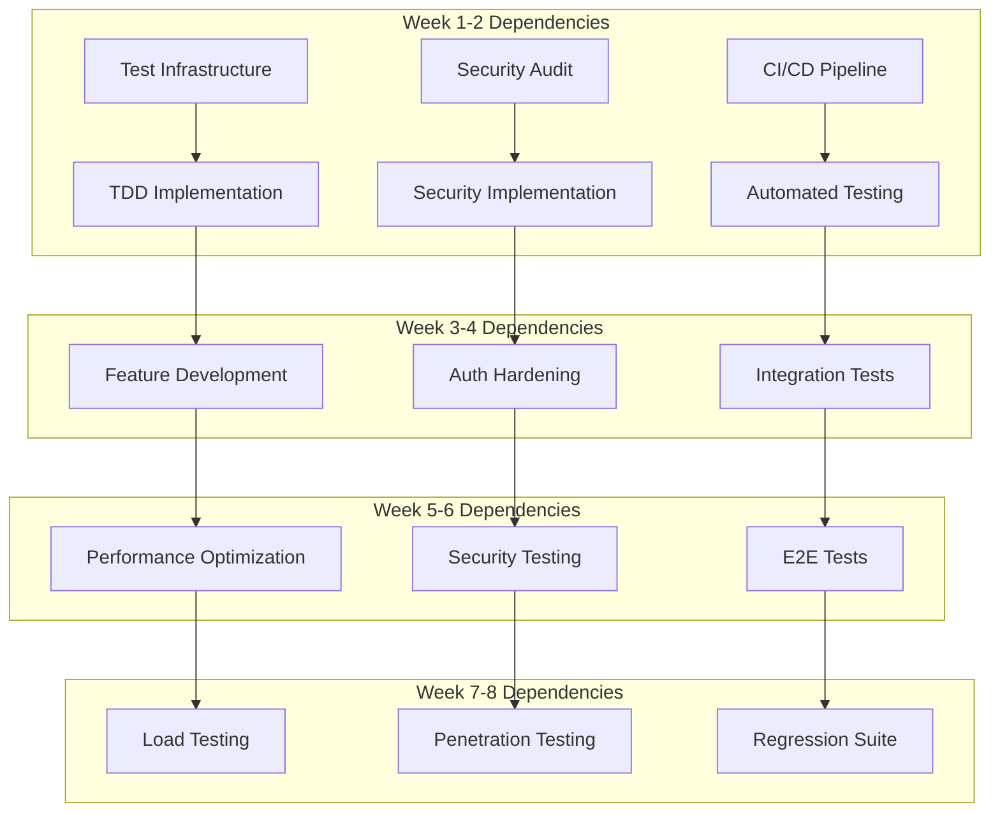

# Founders Day Minnesota - Parallel Execution Strategy & Agent Orchestration

## Overview

This document outlines the parallel execution strategy for transforming the Founders Day Minnesota application into a production-ready MVP within 8 weeks. By utilizing specialized agents working in parallel tracks, we maximize efficiency while maintaining quality.

## Agent Architecture

### Master Orchestrator: BMAD Product Manager Agent

```typescript
interface BMADProductManagerAgent {
  role: 'orchestrator';
  responsibilities: [
    'Overall project coordination',
    'Cross-track dependency management',
    'Daily standup facilitation',
    'Risk identification and mitigation',
    'Progress tracking and reporting',
    'Quality gate enforcement'
  ];
  authority: [
    'Task prioritization',
    'Resource allocation',
    'Blocker resolution',
    'Go/No-go decisions'
  ];
}
```

### Specialized Agent Teams

## Track 1: Infrastructure & Security (Weeks 1-8)

### 1.1 DevOps/SRE Agent

```typescript
interface DevOpsSREAgent {
  expertise: ['CI/CD', 'IaC', 'Monitoring', 'Deployment'];
  
  deliverables: {
    week1: [
      'GitHub Actions CI pipeline',
      'Test automation integration',
      'Code coverage reporting'
    ],
    week2: [
      'Staging environment setup',
      'Production environment setup',
      'Deployment automation'
    ],
    week3_4: [
      'Monitoring stack (Prometheus/Grafana)',
      'Log aggregation (ELK)',
      'Alert configuration'
    ],
    week5_6: [
      'Performance monitoring',
      'Database backup automation',
      'Disaster recovery procedures'
    ],
    week7_8: [
      'Load balancing configuration',
      'Auto-scaling setup',
      'Production readiness checklist'
    ]
  };
  
  parallelTasks: [
    {
      task: 'CI/CD Pipeline',
      dependencies: [],
      duration: '3 days',
      priority: 'P0'
    },
    {
      task: 'Environment Setup',
      dependencies: ['CI/CD Pipeline'],
      duration: '5 days',
      priority: 'P0'
    },
    {
      task: 'Monitoring Stack',
      dependencies: ['Environment Setup'],
      duration: '3 days',
      priority: 'P1'
    }
  ];
}
```

### 1.2 Security Specialist Agent

```typescript
interface SecuritySpecialistAgent {
  expertise: ['AppSec', 'OWASP', 'Compliance', 'PenTesting'];
  
  deliverables: {
    week1_2: [
      'Security audit report',
      'Vulnerability assessment',
      'Security requirements document'
    ],
    week3_4: [
      'Authentication hardening',
      'Authorization implementation',
      'Input validation middleware',
      'Rate limiting setup'
    ],
    week5_6: [
      'OWASP compliance implementation',
      'Security headers configuration',
      'Secrets management setup',
      'Encryption implementation'
    ],
    week7_8: [
      'Penetration testing',
      'Security documentation',
      'Incident response plan',
      'Security training materials'
    ]
  };
  
  parallelTasks: [
    {
      task: 'Security Audit',
      dependencies: [],
      duration: '2 days',
      priority: 'P0'
    },
    {
      task: 'Auth System Hardening',
      dependencies: ['Security Audit'],
      duration: '5 days',
      priority: 'P0'
    },
    {
      task: 'OWASP Implementation',
      dependencies: ['Auth System Hardening'],
      duration: '5 days',
      priority: 'P0'
    }
  ];
}
```

## Track 2: Feature Development (Weeks 1-8)

### 2.1 Frontend Development Agent

```typescript
interface FrontendDeveloperAgent {
  expertise: ['React', 'Next.js', 'TypeScript', 'Testing'];
  
  deliverables: {
    week1_2: [
      'Component test suite setup',
      'Registration flow refactoring with TDD',
      'Form validation with tests'
    ],
    week3_4: [
      'Payment integration hardening',
      'Error boundary implementation',
      'Loading states and feedback',
      'Accessibility improvements'
    ],
    week5_6: [
      'PWA implementation',
      'Offline functionality',
      'Performance optimization',
      'Code splitting'
    ],
    week7_8: [
      'Final UI polish',
      'Cross-browser testing',
      'Mobile optimization',
      'Documentation'
    ]
  };
  
  parallelTasks: [
    {
      task: 'Test Infrastructure',
      dependencies: [],
      duration: '2 days',
      priority: 'P0'
    },
    {
      task: 'Registration Flow TDD',
      dependencies: ['Test Infrastructure'],
      duration: '5 days',
      priority: 'P0'
    },
    {
      task: 'Payment Integration',
      dependencies: ['Registration Flow TDD'],
      duration: '5 days',
      priority: 'P0'
    },
    {
      task: 'PWA Features',
      dependencies: [],
      duration: '3 days',
      priority: 'P1'
    }
  ];
}
```

### 2.2 Backend Development Agent

```typescript
interface BackendDeveloperAgent {
  expertise: ['Node.js', 'Express', 'PostgreSQL', 'Testing'];
  
  deliverables: {
    week1_2: [
      'API test suite setup',
      'Database migration system',
      'Service layer refactoring with TDD'
    ],
    week3_4: [
      'Payment webhook handling',
      'Transaction management',
      'Email queue implementation',
      'Background job processing'
    ],
    week5_6: [
      'API optimization',
      'Caching layer',
      'Database query optimization',
      'Rate limiting'
    ],
    week7_8: [
      'API documentation',
      'Performance tuning',
      'Error handling improvements',
      'Logging enhancement'
    ]
  };
  
  parallelTasks: [
    {
      task: 'Test Infrastructure',
      dependencies: [],
      duration: '2 days',
      priority: 'P0'
    },
    {
      task: 'Service Layer TDD',
      dependencies: ['Test Infrastructure'],
      duration: '5 days',
      priority: 'P0'
    },
    {
      task: 'Payment System',
      dependencies: ['Service Layer TDD'],
      duration: '5 days',
      priority: 'P0'
    },
    {
      task: 'Background Jobs',
      dependencies: [],
      duration: '3 days',
      priority: 'P1'
    }
  ];
}
```

### 2.3 Database Specialist Agent

```typescript
interface DatabaseSpecialistAgent {
  expertise: ['PostgreSQL', 'Performance', 'Migrations', 'Backup'];
  
  deliverables: {
    week1_2: [
      'Migration framework setup',
      'Database schema optimization',
      'Index analysis and creation'
    ],
    week3_4: [
      'Transaction optimization',
      'Query performance tuning',
      'Connection pooling setup'
    ],
    week5_6: [
      'Backup automation',
      'Replication setup',
      'Monitoring queries'
    ],
    week7_8: [
      'Performance benchmarking',
      'Disaster recovery testing',
      'Documentation'
    ]
  };
  
  parallelTasks: [
    {
      task: 'Migration System',
      dependencies: [],
      duration: '2 days',
      priority: 'P0'
    },
    {
      task: 'Schema Optimization',
      dependencies: ['Migration System'],
      duration: '3 days',
      priority: 'P0'
    },
    {
      task: 'Performance Tuning',
      dependencies: ['Schema Optimization'],
      duration: '5 days',
      priority: 'P1'
    }
  ];
}
```

## Track 3: Quality Assurance (Weeks 1-8)

### 3.1 QA Automation Engineer

```typescript
interface QAAutomationEngineer {
  expertise: ['Test Automation', 'Jest', 'Playwright', 'Performance'];
  
  deliverables: {
    week1_2: [
      'Test framework setup',
      'CI integration',
      'Test data management'
    ],
    week3_4: [
      'Unit test implementation',
      'Integration test suite',
      'API test automation'
    ],
    week5_6: [
      'E2E test scenarios',
      'Performance test suite',
      'Load testing setup'
    ],
    week7_8: [
      'Regression suite',
      'Test reporting',
      'Test documentation'
    ]
  };
  
  parallelTasks: [
    {
      task: 'Test Framework',
      dependencies: [],
      duration: '3 days',
      priority: 'P0'
    },
    {
      task: 'Unit Test Suite',
      dependencies: ['Test Framework'],
      duration: '10 days',
      priority: 'P0'
    },
    {
      task: 'E2E Tests',
      dependencies: ['Test Framework'],
      duration: '5 days',
      priority: 'P0'
    },
    {
      task: 'Performance Tests',
      dependencies: ['Test Framework'],
      duration: '3 days',
      priority: 'P1'
    }
  ];
}
```

### 3.2 Performance Engineer

```typescript
interface PerformanceEngineer {
  expertise: ['Performance Testing', 'Optimization', 'Monitoring', 'Analysis'];
  
  deliverables: {
    week3_4: [
      'Performance baseline',
      'Bottleneck identification',
      'Optimization plan'
    ],
    week5_6: [
      'Frontend optimization',
      'Backend optimization',
      'Database optimization',
      'Caching strategy'
    ],
    week7_8: [
      'Load testing',
      'Stress testing',
      'Performance monitoring',
      'Optimization verification'
    ]
  };
  
  parallelTasks: [
    {
      task: 'Performance Baseline',
      dependencies: [],
      duration: '2 days',
      priority: 'P1'
    },
    {
      task: 'Frontend Optimization',
      dependencies: ['Performance Baseline'],
      duration: '5 days',
      priority: 'P1'
    },
    {
      task: 'Load Testing',
      dependencies: [],
      duration: '3 days',
      priority: 'P1'
    }
  ];
}
```

### 3.3 Accessibility Specialist

```typescript
interface AccessibilitySpecialist {
  expertise: ['WCAG', 'Screen Readers', 'Accessibility Testing', 'ARIA'];
  
  deliverables: {
    week3_4: [
      'Accessibility audit',
      'WCAG compliance report',
      'Remediation plan'
    ],
    week5_6: [
      'ARIA implementation',
      'Keyboard navigation',
      'Screen reader optimization',
      'Color contrast fixes'
    ],
    week7_8: [
      'Accessibility testing',
      'Documentation',
      'Training materials'
    ]
  };
  
  parallelTasks: [
    {
      task: 'Accessibility Audit',
      dependencies: [],
      duration: '2 days',
      priority: 'P1'
    },
    {
      task: 'ARIA Implementation',
      dependencies: ['Accessibility Audit'],
      duration: '5 days',
      priority: 'P1'
    }
  ];
}
```

## Coordination Mechanisms

### Daily Synchronization

```typescript
class DailyStandup {
  time: '9:00 AM CST';
  duration: '15 minutes';
  format: 'Async + Sync hybrid';
  
  asyncUpdates: {
    platform: 'Slack #founders-day-standup';
    template: `
      **Yesterday:** What I completed
      **Today:** What I'm working on
      **Blockers:** Any impediments
      **Dependencies:** What I need from others
    `;
    deadline: '8:45 AM CST';
  };
  
  syncDiscussion: {
    focus: 'Blockers and dependencies only';
    participants: 'Agents with blockers + PM';
  };
}
```

### Dependency Management



### Communication Protocols

```typescript
interface CommunicationProtocol {
  channels: {
    urgent: 'Slack #founders-day-urgent',
    blockers: 'Slack #founders-day-blockers',
    general: 'Slack #founders-day-general',
    code_review: 'GitHub PRs',
    documentation: 'Confluence'
  };
  
  escalation: {
    level1: 'Team Lead (5 min)',
    level2: 'PM Agent (15 min)',
    level3: 'Stakeholder (30 min)'
  };
  
  meetings: {
    daily_standup: '9:00 AM',
    weekly_planning: 'Monday 10:00 AM',
    retrospective: 'Friday 3:00 PM'
  };
}
```

## Parallel Execution Timeline

### Week 1-2: Foundation Sprint

```
Track 1: Infrastructure & Security
├── DevOps Agent
│   ├── Day 1-3: CI/CD Pipeline Setup ████████
│   └── Day 4-10: Environment Configuration ████████████
├── Security Agent
│   ├── Day 1-2: Security Audit ████
│   └── Day 3-10: Initial Hardening ████████████████

Track 2: Feature Development  
├── Frontend Agent
│   ├── Day 1-2: Test Setup ████
│   └── Day 3-10: Registration TDD ████████████████
├── Backend Agent
│   ├── Day 1-2: Test Setup ████
│   └── Day 3-10: Service Layer TDD ████████████████
└── Database Agent
    ├── Day 1-2: Migration Setup ████
    └── Day 3-10: Schema Optimization ████████████████

Track 3: Quality Assurance
└── QA Agent
    ├── Day 1-3: Framework Setup ████████
    └── Day 4-10: Initial Test Suites ████████████
```

### Week 3-4: Core Features Sprint

```
Track 1: Infrastructure & Security
├── DevOps Agent
│   └── Day 1-10: Monitoring & Logging ████████████████████
├── Security Agent
│   └── Day 1-10: OWASP Implementation ████████████████████

Track 2: Feature Development  
├── Frontend Agent
│   └── Day 1-10: Payment Integration ████████████████████
├── Backend Agent
│   └── Day 1-10: Payment & Email Systems ████████████████████
└── Database Agent
    └── Day 1-10: Performance Tuning ████████████████████

Track 3: Quality Assurance
├── QA Agent
│   └── Day 1-10: Integration Tests ████████████████████
├── Performance Agent
│   └── Day 1-10: Baseline & Analysis ████████████████████
└── Accessibility Agent
    └── Day 1-10: Audit & Planning ████████████████████
```

### Week 5-6: Optimization Sprint

```
Track 1: Infrastructure & Security
├── DevOps Agent
│   └── Day 1-10: Production Prep ████████████████████
├── Security Agent
│   └── Day 1-10: Advanced Security ████████████████████

Track 2: Feature Development  
├── Frontend Agent
│   └── Day 1-10: PWA & Performance ████████████████████
├── Backend Agent
│   └── Day 1-10: Optimization & Caching ████████████████████
└── Database Agent
    └── Day 1-10: Backup & Replication ████████████████████

Track 3: Quality Assurance
├── QA Agent
│   └── Day 1-10: E2E Test Suite ████████████████████
├── Performance Agent
│   └── Day 1-10: Optimization Implementation ████████████████████
└── Accessibility Agent
    └── Day 1-10: WCAG Implementation ████████████████████
```

### Week 7-8: Hardening Sprint

```
Track 1: Infrastructure & Security
├── DevOps Agent
│   └── Day 1-10: Final Deployment ████████████████████
├── Security Agent
│   └── Day 1-10: Penetration Testing ████████████████████

Track 2: Feature Development  
├── Frontend Agent
│   └── Day 1-10: Polish & Docs ████████████████████
├── Backend Agent
│   └── Day 1-10: Final Optimization ████████████████████
└── Database Agent
    └── Day 1-10: DR Testing ████████████████████

Track 3: Quality Assurance
├── QA Agent
│   └── Day 1-10: Regression Testing ████████████████████
├── Performance Agent
│   └── Day 1-10: Load Testing ████████████████████
└── Accessibility Agent
    └── Day 1-10: Final Testing ████████████████████
```

## Resource Allocation

### Agent Workload Distribution

```typescript
interface WorkloadDistribution {
  fullTime: [
    'Frontend Developer Agent',
    'Backend Developer Agent',
    'QA Automation Engineer',
    'DevOps/SRE Agent'
  ];
  
  partTime_75: [
    'Security Specialist Agent',
    'Database Specialist Agent'
  ];
  
  partTime_50: [
    'Performance Engineer',
    'Accessibility Specialist'
  ];
  
  coordinator: [
    'BMAD Product Manager Agent (100%)'
  ];
}
```

### Skill Matrix

| Agent | Primary Skills | Secondary Skills | Availability |
|-------|---------------|------------------|--------------|
| Frontend Dev | React, Next.js, TDD | Accessibility, PWA | 100% |
| Backend Dev | Node.js, Express, TDD | Database, Security | 100% |
| Database Spec | PostgreSQL, Performance | Backup, Replication | 75% |
| DevOps/SRE | CI/CD, IaC, Monitoring | Security, Networking | 100% |
| Security Spec | AppSec, OWASP | Compliance, Crypto | 75% |
| QA Automation | Testing, Automation | Performance, API | 100% |
| Performance | Testing, Optimization | Monitoring, Analysis | 50% |
| Accessibility | WCAG, Testing | UX, Documentation | 50% |

## Risk Management

### Parallel Execution Risks

```typescript
interface RiskMitigation {
  dependency_delays: {
    risk: 'Blocking dependencies between tracks',
    mitigation: [
      'Daily dependency review',
      'Buffer time in estimates',
      'Alternative task queue'
    ]
  };
  
  communication_gaps: {
    risk: 'Miscommunication between parallel tracks',
    mitigation: [
      'Structured communication protocols',
      'Shared documentation',
      'Regular sync meetings'
    ]
  };
  
  quality_drift: {
    risk: 'Inconsistent quality across tracks',
    mitigation: [
      'Shared quality standards',
      'Cross-track code reviews',
      'Automated quality gates'
    ]
  };
  
  resource_conflicts: {
    risk: 'Agents needed in multiple places',
    mitigation: [
      'Clear priority matrix',
      'Time-boxed consultations',
      'Knowledge documentation'
    ]
  };
}
```

### Contingency Planning

```typescript
class ContingencyPlan {
  scenarioA_AgentUnavailable = {
    trigger: 'Key agent unavailable > 2 days',
    response: [
      'Activate backup agent from pool',
      'Redistribute critical tasks',
      'Adjust timeline if needed'
    ]
  };
  
  scenarioB_TechnicalBlocker = {
    trigger: 'Technical blocker > 1 day',
    response: [
      'Escalate to senior architect',
      'Implement workaround',
      'Document for post-MVP fix'
    ]
  };
  
  scenarioC_ScopeCreep = {
    trigger: 'New requirements mid-sprint',
    response: [
      'Evaluate against MVP criteria',
      'Defer to post-MVP backlog',
      'Communicate impact to stakeholder'
    ]
  };
}
```

## Success Metrics

### Track Performance Indicators

```typescript
interface TrackMetrics {
  velocity: {
    measure: 'Story points completed per sprint',
    target: '80% of committed points',
    tracking: 'JIRA velocity charts'
  };
  
  quality: {
    measure: 'Defect escape rate',
    target: '<5% defects found in later stages',
    tracking: 'Bug tracking system'
  };
  
  coverage: {
    measure: 'Test coverage percentage',
    target: '>80% code coverage',
    tracking: 'SonarQube dashboard'
  };
  
  collaboration: {
    measure: 'Cross-track PR reviews',
    target: '100% PRs reviewed by another track',
    tracking: 'GitHub metrics'
  };
}
```

### Overall Project Health

```typescript
class ProjectHealthDashboard {
  daily_metrics = {
    'Builds Passing': 'target: 95%+',
    'Test Coverage': 'target: 80%+',
    'Open Blockers': 'target: <3',
    'PR Queue': 'target: <5 pending'
  };
  
  weekly_metrics = {
    'Sprint Velocity': 'target: 80%+ commitment',
    'Defect Trend': 'target: declining',
    'Performance Baseline': 'target: improving',
    'Security Findings': 'target: all critical fixed'
  };
  
  milestone_gates = {
    week2: 'Foundation complete, all tests passing',
    week4: 'Core features complete, 70% coverage',
    week6: 'Optimization complete, performance targets met',
    week8: 'Production ready, all gates passed'
  };
}
```

## Tooling and Automation

### Collaboration Tools

```yaml
project_tools:
  code_repository: GitHub
  ci_cd: GitHub Actions
  project_management: JIRA
  documentation: Confluence
  communication: Slack
  monitoring: Datadog
  error_tracking: Sentry
  performance: New Relic
  security_scanning: Snyk
  code_quality: SonarQube
```

### Automation Scripts

```typescript
// Automation for parallel execution
class ParallelExecutionAutomation {
  async dailyHealthCheck(): Promise<HealthReport> {
    const results = await Promise.all([
      this.checkBuilds(),
      this.checkTests(),
      this.checkCoverage(),
      this.checkBlockers(),
      this.checkDependencies()
    ]);
    
    return this.generateReport(results);
  }
  
  async generateDailyStandup(): Promise<StandupReport> {
    const updates = await this.collectAgentUpdates();
    const blockers = await this.identifyBlockers();
    const dependencies = await this.analyzeDependencies();
    
    return {
      date: new Date(),
      updates,
      blockers,
      dependencies,
      actions: this.recommendActions(blockers, dependencies)
    };
  }
  
  async trackProgress(): Promise<ProgressReport> {
    const velocity = await this.calculateVelocity();
    const burndown = await this.generateBurndown();
    const risks = await this.assessRisks();
    
    return {
      velocity,
      burndown,
      risks,
      projection: this.projectCompletion(velocity, burndown)
    };
  }
}
```

## Conclusion

This parallel execution strategy enables the Founders Day Minnesota team to deliver a production-ready MVP in 8 weeks through:

1. **Specialized agents** working in parallel tracks
2. **Clear dependencies** and synchronization points
3. **Automated coordination** and progress tracking
4. **Risk mitigation** strategies
5. **Quality gates** at each milestone

By following this strategy, we ensure maximum efficiency while maintaining the high quality standards required for a production-ready application.