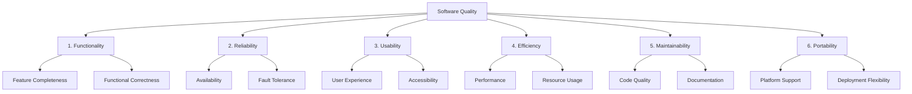

# Founders Day Minnesota - Success Metrics & KPIs

## Executive Summary

This document defines comprehensive success metrics and Key Performance Indicators (KPIs) for the Founders Day Minnesota MVP across all 6 dimensions of software quality. Each metric includes clear targets, measurement methods, and monitoring strategies to ensure production readiness.

## Quality Dimensions Framework



## 1. Functionality Metrics

### 1.1 Feature Completeness

```typescript
interface FeatureCompleteness {
  metric: 'Percentage of MVP features implemented and tested';
  target: '100%';
  measurement: {
    method: 'Feature checklist validation';
    frequency: 'Daily during development';
    tool: 'JIRA feature tracking';
  };
  
  criticalFeatures: [
    { feature: 'User Registration', weight: 15, status: 'pending' },
    { feature: 'Ticket Purchase', weight: 20, status: 'pending' },
    { feature: 'Payment Processing', weight: 20, status: 'pending' },
    { feature: 'QR Code Generation', weight: 10, status: 'pending' },
    { feature: 'Event Check-in', weight: 10, status: 'pending' },
    { feature: 'Admin Dashboard', weight: 15, status: 'pending' },
    { feature: 'Email Notifications', weight: 10, status: 'pending' }
  ];
  
  calculation: 'Σ(completed_features * weight) / 100';
}
```

### 1.2 Functional Correctness

```typescript
interface FunctionalCorrectness {
  metrics: {
    test_pass_rate: {
      target: '>98%';
      current: 'TBD';
      formula: '(passed_tests / total_tests) * 100';
    };
    
    business_logic_accuracy: {
      target: '100%';
      testCases: [
        'Ticket allocation prevents overselling',
        'Payment calculations include all fees',
        'Refund logic follows business rules',
        'Discount codes apply correctly',
        'Inventory tracking is accurate'
      ];
    };
    
    api_contract_compliance: {
      target: '100%';
      validation: 'OpenAPI schema validation';
      coverage: 'All endpoints';
    };
  };
  
  monitoring: {
    realtime: 'Automated test results in CI/CD';
    reporting: 'Daily quality dashboard';
    alerts: 'Immediate on test failure';
  };
}
```

### 1.3 Integration Success Rate

```typescript
interface IntegrationMetrics {
  square_payment: {
    success_rate: { target: '>99.5%', measurement: 'successful_payments / total_attempts' };
    webhook_reliability: { target: '100%', measurement: 'processed_webhooks / received_webhooks' };
    reconciliation_accuracy: { target: '100%', measurement: 'daily_reconciliation_check' };
  };
  
  email_delivery: {
    delivery_rate: { target: '>98%', measurement: 'delivered_emails / sent_emails' };
    bounce_rate: { target: '<2%', measurement: 'bounced_emails / sent_emails' };
    template_rendering: { target: '100%', measurement: 'successful_renders / total_renders' };
  };
  
  monitoring: {
    frequency: 'Real-time with 5-minute aggregation';
    alerting: 'PagerDuty integration for <95% success rate';
    dashboard: 'Grafana integration dashboard';
  };
}
```

## 2. Reliability Metrics

### 2.1 System Availability

```typescript
interface AvailabilityMetrics {
  uptime_target: {
    percentage: '99.9%';
    allowable_downtime: '43.8 minutes/month';
    measurement_period: '30-day rolling window';
  };
  
  calculation: {
    formula: '(total_time - downtime) / total_time * 100';
    exclusions: ['Scheduled maintenance windows'];
    monitoring_tools: ['Pingdom', 'UptimeRobot', 'Custom health checks'];
  };
  
  health_checks: [
    { endpoint: '/api/health', frequency: '30 seconds', timeout: '5 seconds' },
    { endpoint: '/api/health/db', frequency: '60 seconds', timeout: '10 seconds' },
    { endpoint: '/api/health/payments', frequency: '5 minutes', timeout: '15 seconds' }
  ];
  
  incident_response: {
    detection_time: '<1 minute';
    acknowledgment_time: '<5 minutes';
    resolution_time_p1: '<30 minutes';
    resolution_time_p2: '<2 hours';
  };
}
```

### 2.2 Error Rates

```typescript
interface ErrorRateMetrics {
  application_errors: {
    target: '<0.1% of requests';
    categories: {
      '4xx_errors': { target: '<2%', description: 'Client errors' },
      '5xx_errors': { target: '<0.1%', description: 'Server errors' },
      'timeout_errors': { target: '<0.05%', description: 'Request timeouts' },
      'database_errors': { target: '<0.01%', description: 'Database failures' }
    };
  };
  
  payment_errors: {
    declined_rate: { target: '<10%', note: 'Industry standard' };
    processing_errors: { target: '<0.5%', severity: 'critical' };
    timeout_errors: { target: '<0.1%', severity: 'high' };
  };
  
  monitoring: {
    tool: 'Sentry + Custom Metrics';
    aggregation: '1-minute intervals';
    alerting: {
      threshold_breach: 'Immediate alert if target exceeded',
      trend_analysis: 'Alert on 50% increase over baseline'
    };
  };
}
```

### 2.3 Recovery Metrics

```typescript
interface RecoveryMetrics {
  mean_time_to_recovery: {
    target: '<5 minutes';
    measurement: 'incident_start to service_restored';
    tracking: 'Incident management system';
  };
  
  recovery_point_objective: {
    target: '<1 minute data loss';
    method: 'Point-in-time recovery';
    testing: 'Monthly DR drills';
  };
  
  recovery_time_objective: {
    database: '<15 minutes';
    application: '<5 minutes';
    full_system: '<30 minutes';
  };
  
  failover_testing: {
    frequency: 'Monthly';
    scenarios: [
      'Database primary failure',
      'Application server failure',
      'Load balancer failure',
      'Payment provider outage'
    ];
  };
}
```

## 3. Usability Metrics

### 3.1 User Experience Metrics

```typescript
interface UserExperienceMetrics {
  task_completion_rate: {
    registration_flow: { target: '>95%', measurement: 'completed / started' };
    ticket_purchase: { target: '>90%', measurement: 'purchased / cart_added' };
    payment_completion: { target: '>85%', measurement: 'paid / payment_started' };
  };
  
  user_satisfaction: {
    method: 'In-app feedback widget';
    scale: '1-5 stars';
    target: '>4.0 average';
    response_rate_target: '>10%';
  };
  
  error_prevention: {
    form_validation_effectiveness: { target: '>95%', measurement: 'valid_submissions / total' };
    error_message_clarity: { target: '>90%', measurement: 'resolved_errors / shown_errors' };
    help_text_effectiveness: { target: '>80%', measurement: 'reduced_errors_after_help' };
  };
  
  first_time_user_success: {
    target: '>80% complete registration without support';
    measurement: 'Funnel analysis';
    improvement_tracking: 'A/B testing';
  };
}
```

### 3.2 Accessibility Metrics

```typescript
interface AccessibilityMetrics {
  wcag_compliance: {
    level: 'AA';
    target_score: '100%';
    automated_testing: {
      tool: 'axe-core';
      frequency: 'Every build';
      threshold: 'Zero violations';
    };
    manual_testing: {
      screen_reader: 'JAWS, NVDA testing';
      keyboard_navigation: '100% keyboard accessible';
      frequency: 'Weekly';
    };
  };
  
  performance_metrics: {
    screen_reader_announcement_time: '<2 seconds';
    focus_indicator_visibility: '100% of interactive elements';
    color_contrast_ratio: {
      normal_text: '>4.5:1',
      large_text: '>3:1',
      active_elements: '>3:1'
    };
  };
  
  assistive_technology_support: {
    screen_readers: ['JAWS', 'NVDA', 'VoiceOver'];
    keyboard_only: '100% functionality';
    voice_control: 'Dragon NaturallySpeaking compatible';
  };
}
```

### 3.3 Mobile Usability

```typescript
interface MobileUsabilityMetrics {
  responsive_design: {
    breakpoint_coverage: '100% of defined breakpoints';
    touch_target_size: 'Minimum 44x44 pixels';
    viewport_optimization: 'No horizontal scrolling';
  };
  
  mobile_performance: {
    first_contentful_paint: '<1.5s on 4G';
    time_to_interactive: '<3s on 4G';
    tap_delay: '<50ms';
  };
  
  offline_functionality: {
    ticket_viewing: '100% available offline';
    qr_code_display: '100% available offline';
    sync_reliability: '>99% when connection restored';
  };
}
```

## 4. Efficiency Metrics

### 4.1 Performance Metrics

```typescript
interface PerformanceMetrics {
  response_times: {
    api_endpoints: {
      p50: '<100ms',
      p95: '<200ms',
      p99: '<500ms'
    };
    database_queries: {
      simple_queries: '<10ms',
      complex_queries: '<50ms',
      reporting_queries: '<200ms'
    };
    page_load_times: {
      first_contentful_paint: '<1.5s',
      largest_contentful_paint: '<2.5s',
      time_to_interactive: '<3.0s',
      cumulative_layout_shift: '<0.1'
    };
  };
  
  throughput: {
    concurrent_users: {
      target: '1000 simultaneous users';
      measurement: 'Load testing';
      degradation_threshold: '<10% performance impact';
    };
    transactions_per_second: {
      ticket_purchase: '>50 TPS';
      user_registration: '>100 TPS';
      api_requests: '>500 TPS';
    };
  };
  
  lighthouse_scores: {
    performance: '>90';
    accessibility: '>95';
    best_practices: '>95';
    seo: '>95';
    pwa: '>90';
  };
}
```

### 4.2 Resource Utilization

```typescript
interface ResourceUtilization {
  server_resources: {
    cpu_usage: {
      average: '<50%',
      peak: '<80%',
      alert_threshold: '70%'
    };
    memory_usage: {
      average: '<60%',
      peak: '<85%',
      memory_leaks: 'Zero tolerance'
    };
    disk_io: {
      read_latency: '<10ms',
      write_latency: '<20ms',
      iops: '>1000'
    };
  };
  
  database_resources: {
    connection_pool: {
      utilization: '<70%',
      connection_wait_time: '<10ms',
      idle_connections: '10-20%'
    };
    query_performance: {
      slow_query_threshold: '100ms',
      index_usage: '>95%',
      cache_hit_rate: '>90%'
    };
  };
  
  client_resources: {
    bundle_size: {
      initial: '<200KB',
      lazy_loaded: '<500KB per route',
      total: '<2MB'
    };
    memory_usage: {
      initial: '<50MB',
      after_interaction: '<100MB',
      memory_leaks: 'None'
    };
  };
}
```

### 4.3 Cost Efficiency

```typescript
interface CostEfficiency {
  infrastructure_costs: {
    cost_per_transaction: '<$0.01';
    cost_per_user: '<$0.10/month';
    scaling_efficiency: 'Linear with load';
  };
  
  optimization_targets: {
    cdn_cache_hit_rate: '>85%';
    database_query_reduction: '>30% via caching';
    api_call_batching: '>50% reduction';
  };
  
  monitoring: {
    billing_alerts: 'Daily cost tracking';
    anomaly_detection: '20% deviation alerts';
    optimization_recommendations: 'Weekly review';
  };
}
```

## 5. Maintainability Metrics

### 5.1 Code Quality Metrics

```typescript
interface CodeQualityMetrics {
  test_coverage: {
    line_coverage: '>80%';
    branch_coverage: '>75%';
    function_coverage: '>85%';
    integration_test_coverage: '>60%';
  };
  
  code_complexity: {
    cyclomatic_complexity: '<10 per function';
    cognitive_complexity: '<15 per function';
    nesting_depth: '<4 levels';
    file_length: '<300 lines';
  };
  
  technical_debt: {
    debt_ratio: '<5%';
    sqale_rating: 'A';
    issues_per_kloc: '<5';
    remediation_time: '<8 hours per component';
  };
  
  code_standards: {
    linting_errors: 'Zero';
    formatting_consistency: '100%';
    naming_conventions: '100% compliance';
    documentation_coverage: '>80%';
  };
}
```

### 5.2 Development Velocity

```typescript
interface DevelopmentVelocity {
  deployment_metrics: {
    deployment_frequency: 'Daily to staging, weekly to production';
    lead_time: '<2 days from commit to production';
    deployment_success_rate: '>95%';
    rollback_rate: '<5%';
  };
  
  code_review_metrics: {
    review_completion_time: '<4 hours';
    approval_rate: '>90% first pass';
    reviewer_coverage: '100% of PRs';
    automated_checks: '100% pass before review';
  };
  
  bug_metrics: {
    defect_discovery_rate: '<5 per sprint';
    defect_resolution_time: '<1 day for critical';
    regression_rate: '<2%';
    escaped_defects: '<1 per release';
  };
}
```

### 5.3 Documentation Quality

```typescript
interface DocumentationMetrics {
  coverage: {
    api_documentation: '100% of endpoints';
    code_documentation: '>80% of public methods';
    architecture_docs: 'Complete and current';
    runbooks: 'All critical processes';
  };
  
  quality_measures: {
    accuracy: 'Validated with each release';
    completeness: 'Covers all use cases';
    clarity: 'Reading level < grade 10';
    examples: '>1 per feature';
  };
  
  maintenance: {
    update_frequency: 'With every feature change';
    review_cycle: 'Monthly';
    user_feedback: 'Incorporated weekly';
    versioning: 'Synchronized with code';
  };
}
```

## 6. Portability Metrics

### 6.1 Platform Compatibility

```typescript
interface PlatformCompatibility {
  browser_support: {
    desktop: {
      chrome: 'Last 2 versions',
      firefox: 'Last 2 versions',
      safari: 'Last 2 versions',
      edge: 'Last 2 versions'
    };
    mobile: {
      ios_safari: 'iOS 14+',
      chrome_android: 'Last 3 versions',
      samsung_internet: 'Last 2 versions'
    };
    feature_parity: '>95% across all browsers';
  };
  
  device_support: {
    screen_sizes: '320px to 4K';
    orientations: 'Portrait and landscape';
    input_methods: 'Touch, mouse, keyboard';
    performance_variance: '<20% across devices';
  };
  
  api_compatibility: {
    rest_api_version: 'v1 with backward compatibility';
    graphql_support: 'Optional enhancement';
    webhook_versions: 'v1 and v2 supported';
  };
}
```

### 6.2 Deployment Flexibility

```typescript
interface DeploymentFlexibility {
  environment_support: {
    local_development: 'Docker compose setup';
    staging: 'Identical to production';
    production: 'Multi-region capable';
    disaster_recovery: 'Hot standby ready';
  };
  
  infrastructure_agnostic: {
    cloud_providers: ['AWS', 'GCP', 'Azure'];
    container_support: 'Docker/Kubernetes ready';
    database_options: ['PostgreSQL', 'MySQL compatible'];
    cdn_flexibility: 'Provider agnostic';
  };
  
  configuration_management: {
    environment_variables: '100% externalized';
    feature_flags: 'Runtime toggles';
    secrets_management: 'Vault/KMS compatible';
    zero_downtime_updates: 'Blue-green capable';
  };
}
```

### 6.3 Data Portability

```typescript
interface DataPortability {
  import_capabilities: {
    user_data: 'CSV, JSON formats';
    event_data: 'Industry standard formats';
    transaction_history: 'Financial export formats';
    batch_processing: '>10k records/minute';
  };
  
  export_capabilities: {
    gdpr_compliance: 'Full data export <24 hours';
    formats: ['JSON', 'CSV', 'XML'];
    selective_export: 'Granular data selection';
    automated_backups: 'Daily with 30-day retention';
  };
  
  integration_standards: {
    api_standards: 'REST, OpenAPI 3.0';
    data_formats: 'JSON, ISO standards';
    authentication: 'OAuth 2.0, JWT';
    webhooks: 'Industry standard payloads';
  };
}
```

## Monitoring and Reporting

### Real-time Dashboard

```typescript
interface MetricsDashboard {
  overview: {
    health_score: 'Weighted aggregate of all metrics';
    trend_indicators: 'Last 24h, 7d, 30d';
    alert_status: 'Active issues highlighted';
    deployment_status: 'Current version and health';
  };
  
  dimension_views: {
    functionality: 'Feature completion, test results';
    reliability: 'Uptime, error rates, recovery';
    usability: 'User metrics, accessibility scores';
    efficiency: 'Performance, resource usage';
    maintainability: 'Code quality, velocity';
    portability: 'Compatibility matrix';
  };
  
  drill_down: {
    time_series: 'Historical data visualization';
    comparisons: 'Target vs actual';
    predictions: 'Trend-based forecasting';
    recommendations: 'AI-powered insights';
  };
}
```

### Automated Reporting

```typescript
interface AutomatedReports {
  daily_report: {
    recipients: ['dev-team', 'product-owner'];
    content: [
      'Health score summary',
      'Critical metric violations',
      'Deployment summary',
      'Incident report'
    ];
    delivery: '8:00 AM daily';
  };
  
  weekly_report: {
    recipients: ['stakeholders', 'management'];
    content: [
      'Executive summary',
      'Metric trends',
      'Achievement highlights',
      'Risk assessment'
    ];
    delivery: 'Monday 9:00 AM';
  };
  
  monthly_report: {
    recipients: ['executives', 'board'];
    content: [
      'Comprehensive analysis',
      'ROI metrics',
      'User growth',
      'Strategic recommendations'
    ];
    delivery: 'First Monday of month';
  };
}
```

### Alert Configuration

```typescript
interface AlertingStrategy {
  severity_levels: {
    critical: {
      criteria: 'Service down or data loss risk',
      response_time: '<5 minutes',
      escalation: 'Immediate page to on-call'
    };
    high: {
      criteria: 'Performance degradation >50%',
      response_time: '<30 minutes',
      escalation: 'Email + Slack to team'
    };
    medium: {
      criteria: 'Metric threshold breach',
      response_time: '<2 hours',
      escalation: 'Slack notification'
    };
    low: {
      criteria: 'Trend deviation',
      response_time: '<24 hours',
      escalation: 'Dashboard flag'
    };
  };
  
  alert_fatigue_prevention: {
    deduplication: 'Group related alerts';
    smart_routing: 'Context-aware assignment';
    quiet_hours: 'Non-critical delayed';
    auto_resolution: 'Clear when metric recovers';
  };
}
```

## Success Criteria Summary

### MVP Launch Readiness Checklist

```typescript
interface LaunchReadiness {
  must_have: {
    functionality: 'All critical features complete and tested',
    reliability: '>99.9% uptime achieved in staging',
    security: 'All critical vulnerabilities resolved',
    performance: 'All targets met under load',
    accessibility: 'WCAG AA compliance verified',
    documentation: 'User and admin guides complete'
  };
  
  should_have: {
    monitoring: 'All dashboards operational',
    alerting: 'All critical alerts configured',
    backup: 'Disaster recovery tested',
    support: 'Support team trained'
  };
  
  final_sign_off: {
    technical: 'CTO approval',
    product: 'Product owner approval',
    security: 'Security audit passed',
    legal: 'Compliance verified'
  };
}
```

## Continuous Improvement

### Post-Launch Optimization

```typescript
interface ContinuousImprovement {
  metric_review_cycle: 'Weekly team review';
  
  optimization_priorities: [
    'User-reported pain points',
    'Performance bottlenecks',
    'Cost optimization opportunities',
    'Security enhancements'
  ];
  
  feedback_loops: {
    user_feedback: 'In-app feedback analyzed weekly',
    team_retrospectives: 'Bi-weekly improvement sessions',
    metric_analysis: 'AI-powered anomaly detection',
    competitive_analysis: 'Monthly market comparison'
  };
  
  success_evolution: {
    baseline: 'MVP launch metrics',
    month_1: '+10% improvement target',
    quarter_1: '+25% improvement target',
    year_1: '+50% improvement target'
  };
}
```

## Conclusion

These comprehensive metrics and KPIs ensure the Founders Day Minnesota MVP meets and exceeds production quality standards across all 6 dimensions of software quality. By continuously monitoring and optimizing against these targets, we guarantee a robust, scalable, and user-friendly application that delivers exceptional value from day one.