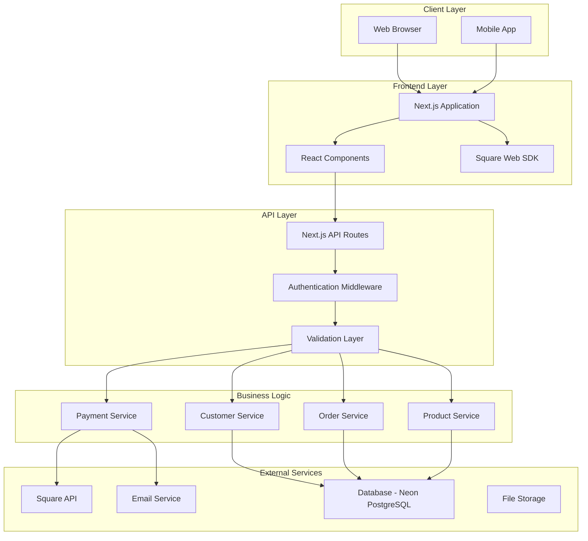
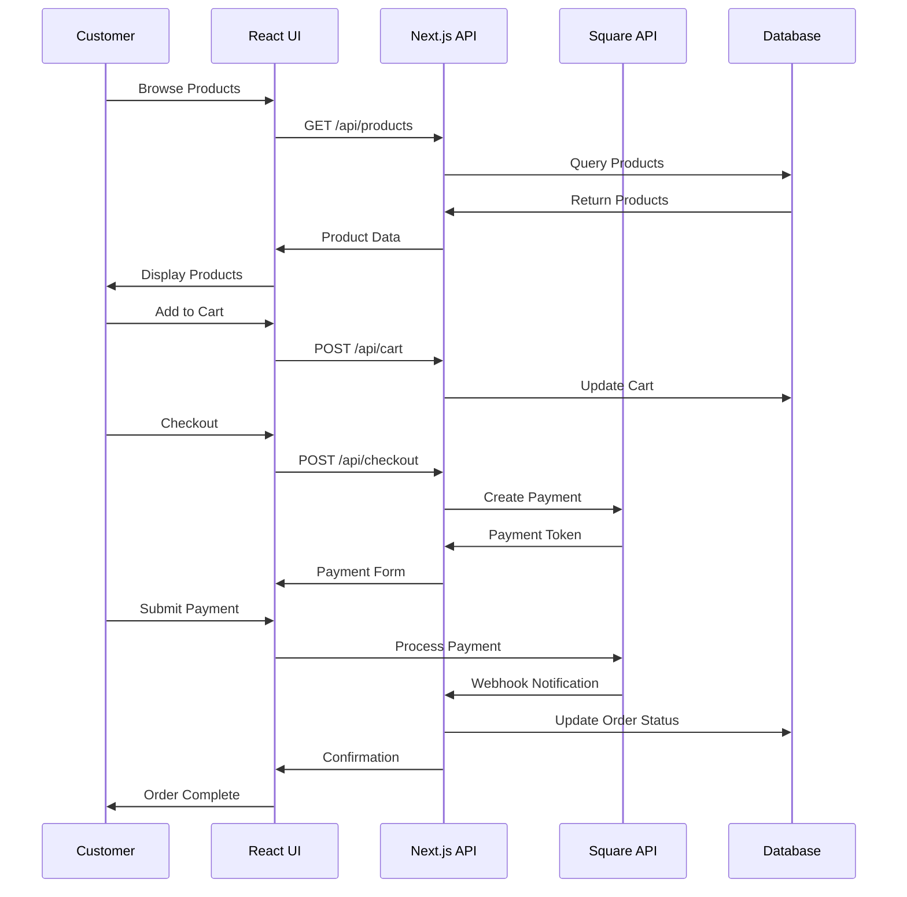
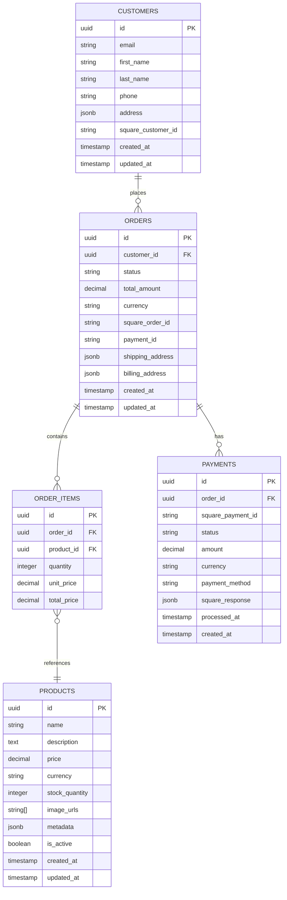

# Technical Architecture Documentation
## Founders Day Square Payment Integration

### Table of Contents
1. [System Overview](#system-overview)
2. [Architecture Diagrams](#architecture-diagrams)
3. [Technology Stack](#technology-stack)
4. [Component Architecture](#component-architecture)
5. [Data Flow](#data-flow)
6. [Integration Points](#integration-points)
7. [Security Architecture](#security-architecture)

---

## System Overview

The Founders Day Square Payment Integration is a comprehensive e-commerce solution built with Next.js and React, integrating Square's payment processing capabilities. The system provides a complete customer experience from product browsing to payment completion, with robust admin functionality for business management.

### Core Capabilities
- **Customer Management**: Registration, profiles, and order history
- **Product Catalog**: Dynamic product display and management
- **Shopping Cart**: Session-based cart with persistence
- **Payment Processing**: Secure Square payment integration
- **Order Management**: Complete order lifecycle tracking
- **Admin Dashboard**: Business intelligence and management tools
- **Reporting**: Sales analytics and financial reporting

### Architecture Principles
- **Microservices Pattern**: Modular API design for scalability
- **Component-Based Frontend**: Reusable React components
- **Event-Driven Architecture**: Webhook-based real-time updates
- **Security-First Design**: PCI-compliant payment handling
- **Mobile-First Responsive**: Progressive web app capabilities

---

## Architecture Diagrams

### High-Level System Architecture



### Component Interaction Diagram



### Database Entity Relationship Diagram



---

## Technology Stack

### Frontend Stack
```typescript
// Core Framework
Next.js 14.x          // React framework with SSR/SSG
React 18.x            // UI library
TypeScript 5.x        // Type safety

// UI/UX Libraries
Tailwind CSS 3.x      // Utility-first CSS framework
Headless UI           // Unstyled, accessible components
React Hook Form       // Form management
Zod                   // Schema validation

// Square Integration
@square/web-sdk       // Square Web Payments SDK
square                // Square Node.js SDK (API routes)

// State Management
Zustand               // Lightweight state management
React Query/TanStack  // Server state management

// Development Tools
ESLint                // Code linting
Prettier              // Code formatting
Jest                  // Testing framework
Playwright            // E2E testing
```

### Backend Stack
```typescript
// API Framework
Next.js API Routes    // Serverless API endpoints
Node.js 18.x          // Runtime environment

// Database
PostgreSQL            // Primary database
Neon                  // Serverless PostgreSQL hosting
Prisma                // Database ORM
Redis                 // Caching layer

// External Services
Square API v2         // Payment processing
Stripe (fallback)     // Alternative payments
SendGrid              // Email service
Cloudinary            // Image storage

// Security
NextAuth.js           // Authentication
bcryptjs              // Password hashing
jsonwebtoken          // JWT tokens
helmet                // Security headers
```

---

## Component Architecture

### Frontend Component Hierarchy

```
src/
├── components/
│   ├── common/
│   │   ├── Button.tsx
│   │   ├── Input.tsx
│   │   ├── Modal.tsx
│   │   └── LoadingSpinner.tsx
│   ├── layout/
│   │   ├── Header.tsx
│   │   ├── Footer.tsx
│   │   ├── Sidebar.tsx
│   │   └── Layout.tsx
│   ├── payment/
│   │   ├── PaymentForm.tsx
│   │   ├── SquareCard.tsx
│   │   ├── PaymentSummary.tsx
│   │   └── PaymentSuccess.tsx
│   ├── product/
│   │   ├── ProductCard.tsx
│   │   ├── ProductList.tsx
│   │   ├── ProductDetail.tsx
│   │   └── ProductSearch.tsx
│   ├── cart/
│   │   ├── CartItem.tsx
│   │   ├── CartSummary.tsx
│   │   ├── CartDrawer.tsx
│   │   └── MiniCart.tsx
│   ├── customer/
│   │   ├── LoginForm.tsx
│   │   ├── RegisterForm.tsx
│   │   ├── ProfileForm.tsx
│   │   └── AddressForm.tsx
│   └── admin/
│       ├── Dashboard.tsx
│       ├── OrderManagement.tsx
│       ├── CustomerManagement.tsx
│       ├── ProductManagement.tsx
│       └── Analytics.tsx
```

### API Route Structure

```
pages/api/ (or app/api/)
├── auth/
│   ├── login.ts
│   ├── register.ts
│   ├── logout.ts
│   └── refresh.ts
├── customers/
│   ├── index.ts          # GET/POST customers
│   ├── [id].ts           # GET/PUT/DELETE customer
│   └── [id]/orders.ts    # Customer orders
├── products/
│   ├── index.ts          # GET/POST products
│   ├── [id].ts           # GET/PUT/DELETE product
│   └── search.ts         # Product search
├── cart/
│   ├── index.ts          # GET/POST cart
│   ├── add.ts            # Add to cart
│   └── remove.ts         # Remove from cart
├── orders/
│   ├── index.ts          # GET/POST orders
│   ├── [id].ts           # GET/PUT order
│   └── [id]/status.ts    # Update order status
├── payments/
│   ├── create.ts         # Create payment intent
│   ├── process.ts        # Process payment
│   └── webhooks.ts       # Square webhooks
└── admin/
    ├── dashboard.ts      # Admin dashboard data
    ├── orders.ts         # Order management
    ├── customers.ts      # Customer management
    └── analytics.ts      # Business analytics
```

---

## Data Flow

### Payment Processing Flow

```typescript
// 1. Customer initiates checkout
interface CheckoutRequest {
  cart_items: CartItem[];
  customer_info: CustomerInfo;
  shipping_address: Address;
  billing_address: Address;
}

// 2. Create order in database
const order = await createOrder({
  customer_id: customer.id,
  items: cart_items,
  total: calculateTotal(cart_items),
  status: 'pending'
});

// 3. Initialize Square payment
const squarePayment = await square.ordersApi.createOrder({
  location_id: SQUARE_LOCATION_ID,
  order: {
    line_items: cart_items.map(item => ({
      name: item.product.name,
      quantity: item.quantity.toString(),
      base_price_money: {
        amount: item.product.price * 100, // Convert to cents
        currency: 'USD'
      }
    }))
  }
});

// 4. Client-side payment processing
const paymentForm = new square.payments(APP_ID, LOCATION_ID);
const card = await paymentForm.card();
const result = await card.tokenize();

// 5. Server-side payment completion
const payment = await square.paymentsApi.createPayment({
  source_id: result.token,
  amount_money: {
    amount: order.total * 100,
    currency: 'USD'
  },
  order_id: squarePayment.result.order.id
});

// 6. Update order status
await updateOrder(order.id, {
  status: 'completed',
  square_payment_id: payment.result.payment.id
});
```

### Customer Data Synchronization

```typescript
// Sync customer data between local DB and Square
export async function syncCustomer(localCustomer: Customer) {
  try {
    // Check if customer exists in Square
    const squareCustomer = await square.customersApi.searchCustomers({
      filter: {
        email_address: {
          exact: localCustomer.email
        }
      }
    });

    if (squareCustomer.result.customers?.length === 0) {
      // Create new Square customer
      const newSquareCustomer = await square.customersApi.createCustomer({
        given_name: localCustomer.first_name,
        family_name: localCustomer.last_name,
        email_address: localCustomer.email,
        phone_number: localCustomer.phone
      });

      // Update local customer with Square ID
      await updateCustomer(localCustomer.id, {
        square_customer_id: newSquareCustomer.result.customer.id
      });
    }
  } catch (error) {
    console.error('Customer sync failed:', error);
    throw error;
  }
}
```

---

## Integration Points

### Square API Integration

```typescript
// Square Client Configuration
import { Client, Environment } from 'square';

const square = new Client({
  accessToken: process.env.SQUARE_ACCESS_TOKEN,
  environment: process.env.NODE_ENV === 'production' 
    ? Environment.Production 
    : Environment.Sandbox
});

// API Endpoints Used
export const squareServices = {
  // Payments API
  payments: square.paymentsApi,
  
  // Orders API
  orders: square.ordersApi,
  
  // Customers API
  customers: square.customersApi,
  
  // Catalog API (for products)
  catalog: square.catalogApi,
  
  // Locations API
  locations: square.locationsApi,
  
  // Webhooks API
  webhooks: square.webhookSubscriptionsApi
};
```

### Database Integration

```typescript
// Prisma Schema Integration
// prisma/schema.prisma
generator client {
  provider = "prisma-client-js"
}

datasource db {
  provider = "postgresql"
  url      = env("DATABASE_URL")
}

model Customer {
  id               String   @id @default(uuid())
  email            String   @unique
  firstName        String   @map("first_name")
  lastName         String   @map("last_name")
  phone            String?
  address          Json?
  squareCustomerId String?  @map("square_customer_id")
  orders           Order[]
  createdAt        DateTime @default(now()) @map("created_at")
  updatedAt        DateTime @updatedAt @map("updated_at")

  @@map("customers")
}

// Database Operations
export class DatabaseService {
  private prisma = new PrismaClient();

  async createCustomer(data: CreateCustomerData): Promise<Customer> {
    return this.prisma.customer.create({ data });
  }

  async findCustomerByEmail(email: string): Promise<Customer | null> {
    return this.prisma.customer.findUnique({ where: { email } });
  }

  async createOrder(data: CreateOrderData): Promise<Order> {
    return this.prisma.order.create({
      data,
      include: {
        items: {
          include: {
            product: true
          }
        },
        customer: true
      }
    });
  }
}
```

### Webhook Integration

```typescript
// Webhook Handler for Square Events
export default async function handler(
  req: NextApiRequest,
  res: NextApiResponse
) {
  if (req.method !== 'POST') {
    return res.status(405).json({ error: 'Method not allowed' });
  }

  // Verify webhook signature
  const signature = req.headers['x-square-signature'] as string;
  const body = JSON.stringify(req.body);
  
  if (!verifyWebhookSignature(signature, body)) {
    return res.status(401).json({ error: 'Invalid signature' });
  }

  const { type, data } = req.body;

  try {
    switch (type) {
      case 'payment.updated':
        await handlePaymentUpdate(data);
        break;
      
      case 'order.updated':
        await handleOrderUpdate(data);
        break;
      
      case 'customer.created':
        await handleCustomerCreated(data);
        break;
      
      default:
        console.log(`Unhandled webhook type: ${type}`);
    }

    res.status(200).json({ success: true });
  } catch (error) {
    console.error('Webhook processing error:', error);
    res.status(500).json({ error: 'Webhook processing failed' });
  }
}

function verifyWebhookSignature(signature: string, body: string): boolean {
  const hmac = crypto.createHmac('sha1', process.env.SQUARE_WEBHOOK_SECRET!);
  hmac.update(body);
  const expectedSignature = hmac.digest('base64');
  return signature === expectedSignature;
}
```

---

## Security Architecture

### Authentication & Authorization

```typescript
// JWT-based Authentication
export interface AuthToken {
  user_id: string;
  email: string;
  role: 'customer' | 'admin';
  exp: number;
}

export function verifyToken(token: string): AuthToken {
  return jwt.verify(token, process.env.JWT_SECRET!) as AuthToken;
}

// Role-based Access Control
export function requireAuth(roles: string[] = []) {
  return (req: NextApiRequest, res: NextApiResponse, next: NextFunction) => {
    const token = req.headers.authorization?.replace('Bearer ', '');
    
    if (!token) {
      return res.status(401).json({ error: 'No token provided' });
    }

    try {
      const decoded = verifyToken(token);
      
      if (roles.length > 0 && !roles.includes(decoded.role)) {
        return res.status(403).json({ error: 'Insufficient permissions' });
      }

      req.user = decoded;
      next();
    } catch (error) {
      return res.status(401).json({ error: 'Invalid token' });
    }
  };
}
```

### Data Encryption & PCI Compliance

```typescript
// Environment Configuration for Security
export const securityConfig = {
  // SSL/HTTPS enforcement
  forceSSL: process.env.NODE_ENV === 'production',
  
  // CORS configuration
  corsOrigins: process.env.ALLOWED_ORIGINS?.split(',') || ['http://localhost:3000'],
  
  // Rate limiting
  rateLimit: {
    windowMs: 15 * 60 * 1000, // 15 minutes
    max: 100 // limit each IP to 100 requests per windowMs
  },
  
  // Security headers
  securityHeaders: {
    contentSecurityPolicy: "default-src 'self'; script-src 'self' 'unsafe-inline' https://js.squareup.com",
    strictTransportSecurity: 'max-age=31536000; includeSubDomains; preload',
    xFrameOptions: 'DENY',
    xContentTypeOptions: 'nosniff',
    referrerPolicy: 'strict-origin-when-cross-origin'
  }
};

// PCI-DSS Compliance Measures
export const pciCompliance = {
  // No card data storage - Square handles tokenization
  cardDataHandling: 'TOKENIZATION_ONLY',
  
  // Secure transmission
  dataTransmission: 'TLS_1_2_MINIMUM',
  
  // Access controls
  accessControl: 'ROLE_BASED_WITH_MFA',
  
  // Audit logging
  auditLogging: 'COMPREHENSIVE_TRANSACTION_LOGS',
  
  // Regular security testing
  securityTesting: 'QUARTERLY_PENETRATION_TESTING'
};
```

### Error Handling & Monitoring

```typescript
// Centralized Error Handling
export class APIError extends Error {
  statusCode: number;
  code: string;
  details?: any;

  constructor(message: string, statusCode: number, code: string, details?: any) {
    super(message);
    this.statusCode = statusCode;
    this.code = code;
    this.details = details;
  }
}

export function errorHandler(
  error: Error,
  req: NextApiRequest,
  res: NextApiResponse,
  next: NextFunction
) {
  // Log error for monitoring
  console.error('API Error:', {
    message: error.message,
    stack: error.stack,
    url: req.url,
    method: req.method,
    timestamp: new Date().toISOString()
  });

  if (error instanceof APIError) {
    return res.status(error.statusCode).json({
      error: error.message,
      code: error.code,
      details: error.details
    });
  }

  // Generic error response
  res.status(500).json({
    error: 'Internal server error',
    code: 'INTERNAL_ERROR'
  });
}

// Monitoring Integration
export const monitoring = {
  // Performance monitoring
  performanceTracking: 'NEW_RELIC_OR_DATADOG',
  
  // Error tracking
  errorTracking: 'SENTRY_INTEGRATION',
  
  // Uptime monitoring
  uptimeMonitoring: 'PINGDOM_OR_UPTIME_ROBOT',
  
  // Business metrics
  businessMetrics: 'CUSTOM_ANALYTICS_DASHBOARD'
};
```

---

## Performance Optimization

### Caching Strategy

```typescript
// Redis Caching Implementation
import Redis from 'ioredis';

const redis = new Redis(process.env.REDIS_URL);

export class CacheService {
  async get<T>(key: string): Promise<T | null> {
    const cached = await redis.get(key);
    return cached ? JSON.parse(cached) : null;
  }

  async set(key: string, value: any, ttl: number = 3600): Promise<void> {
    await redis.setex(key, ttl, JSON.stringify(value));
  }

  async invalidate(pattern: string): Promise<void> {
    const keys = await redis.keys(pattern);
    if (keys.length > 0) {
      await redis.del(...keys);
    }
  }
}

// Caching Layers
export const cachingStrategy = {
  // Static content (24 hours)
  staticContent: 86400,
  
  // Product catalog (1 hour)
  productCatalog: 3600,
  
  // Customer data (15 minutes)
  customerData: 900,
  
  // Cart data (30 minutes)
  cartData: 1800,
  
  // Order data (5 minutes)
  orderData: 300
};
```

### Database Optimization

```typescript
// Database Connection Pooling
export const databaseConfig = {
  connectionPool: {
    min: 2,
    max: 10,
    acquireTimeoutMillis: 30000,
    createTimeoutMillis: 30000,
    destroyTimeoutMillis: 5000,
    idleTimeoutMillis: 30000,
    reapIntervalMillis: 1000,
    createRetryIntervalMillis: 100
  },
  
  // Query optimization
  queryOptimization: {
    enableQueryLogging: process.env.NODE_ENV === 'development',
    slowQueryThreshold: 1000,
    indexStrategy: 'COMPOSITE_INDEXES_FOR_COMMON_QUERIES'
  }
};

// Database Indexes for Performance
const criticalIndexes = [
  'customers(email)',
  'customers(square_customer_id)',
  'orders(customer_id, created_at)',
  'orders(status, created_at)',
  'order_items(order_id)',
  'products(is_active, created_at)',
  'payments(square_payment_id)',
  'payments(order_id, status)'
];
```

---

This technical architecture documentation provides a comprehensive overview of the Square payment integration system. The next sections will cover database schema, API documentation, and implementation guides in detail.