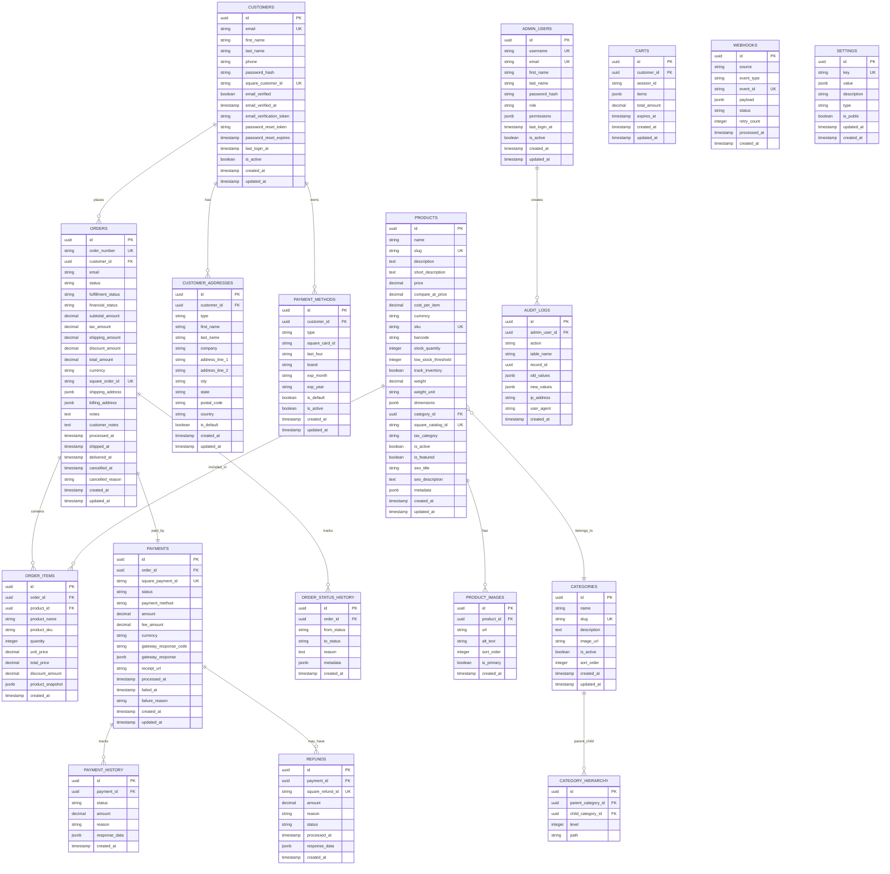

# Database Schema Documentation
## Founders Day Square Payment Integration

### Table of Contents
1. [Database Overview](#database-overview)
2. [Entity Relationship Diagram](#entity-relationship-diagram)
3. [Table Definitions](#table-definitions)
4. [Indexes and Performance](#indexes-and-performance)
5. [Data Migration Scripts](#data-migration-scripts)
6. [Backup and Recovery](#backup-and-recovery)

---

## Database Overview

### Database Configuration
- **Database**: PostgreSQL 15.x
- **Hosting**: Neon Serverless PostgreSQL
- **ORM**: Prisma 5.x
- **Connection Pooling**: PgBouncer
- **Backup Strategy**: Automated daily backups with point-in-time recovery

### Design Principles
- **Normalization**: 3NF compliance with strategic denormalization for performance
- **ACID Compliance**: Full transaction support for financial operations
- **Audit Trail**: Comprehensive logging for all financial transactions
- **Scalability**: Partitioning strategy for high-volume tables
- **Security**: Row-level security and encrypted sensitive data

---

## Entity Relationship Diagram



---

## Table Definitions

### Customers Table

```sql
CREATE TABLE customers (
    id UUID PRIMARY KEY DEFAULT gen_random_uuid(),
    email VARCHAR(255) UNIQUE NOT NULL,
    first_name VARCHAR(100) NOT NULL,
    last_name VARCHAR(100) NOT NULL,
    phone VARCHAR(20),
    password_hash VARCHAR(255) NOT NULL,
    square_customer_id VARCHAR(255) UNIQUE,
    email_verified BOOLEAN DEFAULT FALSE,
    email_verified_at TIMESTAMP,
    email_verification_token VARCHAR(255),
    password_reset_token VARCHAR(255),
    password_reset_expires TIMESTAMP,
    last_login_at TIMESTAMP,
    is_active BOOLEAN DEFAULT TRUE,
    created_at TIMESTAMP DEFAULT CURRENT_TIMESTAMP,
    updated_at TIMESTAMP DEFAULT CURRENT_TIMESTAMP
);

-- Indexes
CREATE INDEX idx_customers_email ON customers(email);
CREATE INDEX idx_customers_square_id ON customers(square_customer_id);
CREATE INDEX idx_customers_created_at ON customers(created_at);
CREATE INDEX idx_customers_active ON customers(is_active, created_at);

-- Triggers
CREATE TRIGGER update_customers_updated_at 
    BEFORE UPDATE ON customers 
    FOR EACH ROW 
    EXECUTE FUNCTION update_updated_at_column();
```

### Products Table

```sql
CREATE TABLE products (
    id UUID PRIMARY KEY DEFAULT gen_random_uuid(),
    name VARCHAR(255) NOT NULL,
    slug VARCHAR(255) UNIQUE NOT NULL,
    description TEXT,
    short_description TEXT,
    price DECIMAL(10,2) NOT NULL,
    compare_at_price DECIMAL(10,2),
    cost_per_item DECIMAL(10,2),
    currency VARCHAR(3) DEFAULT 'USD',
    sku VARCHAR(100) UNIQUE,
    barcode VARCHAR(100),
    stock_quantity INTEGER DEFAULT 0,
    low_stock_threshold INTEGER DEFAULT 5,
    track_inventory BOOLEAN DEFAULT TRUE,
    weight DECIMAL(8,2),
    weight_unit VARCHAR(10) DEFAULT 'lb',
    dimensions JSONB,
    category_id UUID REFERENCES categories(id),
    square_catalog_id VARCHAR(255) UNIQUE,
    tax_category VARCHAR(50),
    is_active BOOLEAN DEFAULT TRUE,
    is_featured BOOLEAN DEFAULT FALSE,
    seo_title VARCHAR(255),
    seo_description TEXT,
    metadata JSONB,
    created_at TIMESTAMP DEFAULT CURRENT_TIMESTAMP,
    updated_at TIMESTAMP DEFAULT CURRENT_TIMESTAMP
);

-- Indexes
CREATE INDEX idx_products_slug ON products(slug);
CREATE INDEX idx_products_sku ON products(sku);
CREATE INDEX idx_products_category ON products(category_id);
CREATE INDEX idx_products_active ON products(is_active, created_at);
CREATE INDEX idx_products_featured ON products(is_featured, is_active);
CREATE INDEX idx_products_price ON products(price);
CREATE INDEX idx_products_stock ON products(stock_quantity);
CREATE INDEX idx_products_square_id ON products(square_catalog_id);

-- Full-text search
CREATE INDEX idx_products_search ON products USING gin(
    to_tsvector('english', name || ' ' || COALESCE(description, '') || ' ' || COALESCE(sku, ''))
);
```

### Orders Table

```sql
CREATE TABLE orders (
    id UUID PRIMARY KEY DEFAULT gen_random_uuid(),
    order_number VARCHAR(50) UNIQUE NOT NULL,
    customer_id UUID REFERENCES customers(id),
    email VARCHAR(255) NOT NULL,
    status VARCHAR(50) DEFAULT 'pending',
    fulfillment_status VARCHAR(50) DEFAULT 'unfulfilled',
    financial_status VARCHAR(50) DEFAULT 'pending',
    subtotal_amount DECIMAL(10,2) NOT NULL,
    tax_amount DECIMAL(10,2) DEFAULT 0,
    shipping_amount DECIMAL(10,2) DEFAULT 0,
    discount_amount DECIMAL(10,2) DEFAULT 0,
    total_amount DECIMAL(10,2) NOT NULL,
    currency VARCHAR(3) DEFAULT 'USD',
    square_order_id VARCHAR(255) UNIQUE,
    shipping_address JSONB,
    billing_address JSONB,
    notes TEXT,
    customer_notes TEXT,
    processed_at TIMESTAMP,
    shipped_at TIMESTAMP,
    delivered_at TIMESTAMP,
    cancelled_at TIMESTAMP,
    cancelled_reason TEXT,
    created_at TIMESTAMP DEFAULT CURRENT_TIMESTAMP,
    updated_at TIMESTAMP DEFAULT CURRENT_TIMESTAMP
);

-- Indexes
CREATE INDEX idx_orders_number ON orders(order_number);
CREATE INDEX idx_orders_customer ON orders(customer_id, created_at);
CREATE INDEX idx_orders_status ON orders(status, created_at);
CREATE INDEX idx_orders_financial_status ON orders(financial_status);
CREATE INDEX idx_orders_fulfillment_status ON orders(fulfillment_status);
CREATE INDEX idx_orders_total ON orders(total_amount);
CREATE INDEX idx_orders_square_id ON orders(square_order_id);
CREATE INDEX idx_orders_email ON orders(email);
CREATE INDEX idx_orders_date_range ON orders(created_at, status);

-- Generate order number function
CREATE OR REPLACE FUNCTION generate_order_number() RETURNS VARCHAR(50) AS $$
DECLARE
    new_number VARCHAR(50);
    counter INTEGER;
BEGIN
    SELECT COALESCE(MAX(CAST(SUBSTRING(order_number, 4) AS INTEGER)), 0) + 1
    INTO counter
    FROM orders
    WHERE order_number LIKE 'FD-%';
    
    new_number := 'FD-' || LPAD(counter::TEXT, 6, '0');
    RETURN new_number;
END;
$$ LANGUAGE plpgsql;

-- Trigger to auto-generate order number
CREATE OR REPLACE FUNCTION set_order_number() RETURNS TRIGGER AS $$
BEGIN
    IF NEW.order_number IS NULL THEN
        NEW.order_number := generate_order_number();
    END IF;
    RETURN NEW;
END;
$$ LANGUAGE plpgsql;

CREATE TRIGGER trigger_set_order_number 
    BEFORE INSERT ON orders 
    FOR EACH ROW 
    EXECUTE FUNCTION set_order_number();
```

### Payments Table

```sql
CREATE TABLE payments (
    id UUID PRIMARY KEY DEFAULT gen_random_uuid(),
    order_id UUID NOT NULL REFERENCES orders(id),
    square_payment_id VARCHAR(255) UNIQUE,
    status VARCHAR(50) DEFAULT 'pending',
    payment_method VARCHAR(50),
    amount DECIMAL(10,2) NOT NULL,
    fee_amount DECIMAL(10,2) DEFAULT 0,
    currency VARCHAR(3) DEFAULT 'USD',
    gateway_response_code VARCHAR(50),
    gateway_response JSONB,
    receipt_url VARCHAR(500),
    processed_at TIMESTAMP,
    failed_at TIMESTAMP,
    failure_reason TEXT,
    created_at TIMESTAMP DEFAULT CURRENT_TIMESTAMP,
    updated_at TIMESTAMP DEFAULT CURRENT_TIMESTAMP
);

-- Indexes
CREATE INDEX idx_payments_order ON payments(order_id);
CREATE INDEX idx_payments_square_id ON payments(square_payment_id);
CREATE INDEX idx_payments_status ON payments(status, created_at);
CREATE INDEX idx_payments_amount ON payments(amount);
CREATE INDEX idx_payments_processed ON payments(processed_at);
```

---

## Data Types and Enums

### Order Status Enum

```sql
CREATE TYPE order_status AS ENUM (
    'pending',
    'confirmed',
    'processing',
    'shipped',
    'delivered',
    'cancelled',
    'refunded',
    'failed'
);

CREATE TYPE fulfillment_status AS ENUM (
    'unfulfilled',
    'partial',
    'fulfilled',
    'cancelled'
);

CREATE TYPE financial_status AS ENUM (
    'pending',
    'authorized',
    'paid',
    'partial',
    'refunded',
    'cancelled',
    'failed'
);
```

### Payment Status Enum

```sql
CREATE TYPE payment_status AS ENUM (
    'pending',
    'processing',
    'completed',
    'failed',
    'cancelled',
    'refunded'
);

CREATE TYPE payment_method AS ENUM (
    'credit_card',
    'debit_card',
    'cash',
    'bank_transfer',
    'digital_wallet'
);
```

---

## Indexes and Performance

### Performance-Critical Indexes

```sql
-- Customer lookup indexes
CREATE INDEX CONCURRENTLY idx_customers_email_active 
    ON customers(email) WHERE is_active = true;

-- Order management indexes
CREATE INDEX CONCURRENTLY idx_orders_customer_status 
    ON orders(customer_id, status, created_at);

CREATE INDEX CONCURRENTLY idx_orders_status_date 
    ON orders(status, created_at DESC);

-- Product catalog indexes
CREATE INDEX CONCURRENTLY idx_products_category_active 
    ON products(category_id, is_active, created_at);

CREATE INDEX CONCURRENTLY idx_products_featured_active 
    ON products(is_featured, is_active) WHERE is_active = true;

-- Payment processing indexes
CREATE INDEX CONCURRENTLY idx_payments_order_status 
    ON payments(order_id, status);

-- Audit and reporting indexes
CREATE INDEX CONCURRENTLY idx_audit_logs_user_date 
    ON audit_logs(admin_user_id, created_at);

CREATE INDEX CONCURRENTLY idx_audit_logs_table_record 
    ON audit_logs(table_name, record_id);
```

### Composite Indexes for Common Queries

```sql
-- Order dashboard queries
CREATE INDEX CONCURRENTLY idx_orders_dashboard 
    ON orders(status, financial_status, created_at DESC);

-- Customer order history
CREATE INDEX CONCURRENTLY idx_customer_orders 
    ON orders(customer_id, created_at DESC) 
    WHERE status != 'cancelled';

-- Product inventory management
CREATE INDEX CONCURRENTLY idx_products_inventory 
    ON products(track_inventory, stock_quantity, is_active) 
    WHERE track_inventory = true;

-- Sales reporting
CREATE INDEX CONCURRENTLY idx_orders_sales_report 
    ON orders(created_at, status, total_amount) 
    WHERE status IN ('completed', 'delivered');
```

---

## Data Migration Scripts

### Initial Schema Setup

```sql
-- 001_initial_schema.sql
BEGIN;

-- Enable UUID extension
CREATE EXTENSION IF NOT EXISTS "uuid-ossp";
CREATE EXTENSION IF NOT EXISTS "pgcrypto";

-- Create updated_at trigger function
CREATE OR REPLACE FUNCTION update_updated_at_column()
RETURNS TRIGGER AS $$
BEGIN
    NEW.updated_at = CURRENT_TIMESTAMP;
    RETURN NEW;
END;
$$ language 'plpgsql';

-- Create all tables (as defined above)
-- ... (table creation scripts)

COMMIT;
```

### Sample Data Migration

```sql
-- 002_sample_data.sql
BEGIN;

-- Insert sample categories
INSERT INTO categories (id, name, slug, description, is_active, sort_order) VALUES
    (gen_random_uuid(), 'Electronics', 'electronics', 'Electronic devices and accessories', true, 1),
    (gen_random_uuid(), 'Clothing', 'clothing', 'Apparel and fashion items', true, 2),
    (gen_random_uuid(), 'Books', 'books', 'Books and publications', true, 3);

-- Insert sample products
INSERT INTO products (name, slug, description, price, currency, sku, category_id, is_active) 
SELECT 
    'Sample Product ' || generate_series,
    'sample-product-' || generate_series,
    'Description for sample product ' || generate_series,
    (random() * 100 + 10)::numeric(10,2),
    'USD',
    'SKU-' || LPAD(generate_series::text, 6, '0'),
    (SELECT id FROM categories ORDER BY random() LIMIT 1),
    true
FROM generate_series(1, 50);

COMMIT;
```

### Square Integration Migration

```sql
-- 003_square_integration.sql
BEGIN;

-- Add Square-specific columns
ALTER TABLE customers ADD COLUMN IF NOT EXISTS square_customer_id VARCHAR(255) UNIQUE;
ALTER TABLE products ADD COLUMN IF NOT EXISTS square_catalog_id VARCHAR(255) UNIQUE;
ALTER TABLE orders ADD COLUMN IF NOT EXISTS square_order_id VARCHAR(255) UNIQUE;
ALTER TABLE payments ADD COLUMN IF NOT EXISTS square_payment_id VARCHAR(255) UNIQUE;

-- Create indexes for Square IDs
CREATE INDEX CONCURRENTLY IF NOT EXISTS idx_customers_square_id ON customers(square_customer_id);
CREATE INDEX CONCURRENTLY IF NOT EXISTS idx_products_square_id ON products(square_catalog_id);
CREATE INDEX CONCURRENTLY IF NOT EXISTS idx_orders_square_id ON orders(square_order_id);
CREATE INDEX CONCURRENTLY IF NOT EXISTS idx_payments_square_id ON payments(square_payment_id);

COMMIT;
```

---

## Database Views

### Customer Summary View

```sql
CREATE VIEW customer_summary AS
SELECT 
    c.id,
    c.email,
    c.first_name,
    c.last_name,
    c.created_at as customer_since,
    COUNT(o.id) as total_orders,
    COALESCE(SUM(o.total_amount), 0) as total_spent,
    MAX(o.created_at) as last_order_date,
    AVG(o.total_amount) as avg_order_value
FROM customers c
LEFT JOIN orders o ON c.id = o.customer_id AND o.status IN ('completed', 'delivered')
WHERE c.is_active = true
GROUP BY c.id, c.email, c.first_name, c.last_name, c.created_at;
```

### Product Performance View

```sql
CREATE VIEW product_performance AS
SELECT 
    p.id,
    p.name,
    p.sku,
    p.price,
    p.stock_quantity,
    COALESCE(SUM(oi.quantity), 0) as total_sold,
    COALESCE(SUM(oi.total_price), 0) as total_revenue,
    COUNT(DISTINCT oi.order_id) as orders_count
FROM products p
LEFT JOIN order_items oi ON p.id = oi.product_id
LEFT JOIN orders o ON oi.order_id = o.id AND o.status IN ('completed', 'delivered')
WHERE p.is_active = true
GROUP BY p.id, p.name, p.sku, p.price, p.stock_quantity;
```

### Sales Summary View

```sql
CREATE VIEW sales_summary AS
SELECT 
    DATE(o.created_at) as sale_date,
    COUNT(*) as orders_count,
    SUM(o.total_amount) as total_revenue,
    AVG(o.total_amount) as avg_order_value,
    SUM(o.tax_amount) as total_tax,
    SUM(o.shipping_amount) as total_shipping
FROM orders o
WHERE o.status IN ('completed', 'delivered')
GROUP BY DATE(o.created_at)
ORDER BY sale_date DESC;
```

---

## Backup and Recovery

### Backup Strategy

```bash
#!/bin/bash
# backup_database.sh

# Configuration
DB_NAME="founders_day_production"
BACKUP_DIR="/backups/postgres"
RETENTION_DAYS=30

# Create timestamped backup
TIMESTAMP=$(date +"%Y%m%d_%H%M%S")
BACKUP_FILE="${BACKUP_DIR}/${DB_NAME}_${TIMESTAMP}.sql"

# Full database backup
pg_dump -h $DB_HOST -U $DB_USER -d $DB_NAME --verbose --clean --create > $BACKUP_FILE

# Compress backup
gzip $BACKUP_FILE

# Upload to cloud storage (optional)
aws s3 cp ${BACKUP_FILE}.gz s3://founder-day-backups/database/

# Clean old backups
find $BACKUP_DIR -name "*.sql.gz" -mtime +$RETENTION_DAYS -delete

echo "Backup completed: ${BACKUP_FILE}.gz"
```

### Point-in-Time Recovery

```sql
-- Enable point-in-time recovery
ALTER SYSTEM SET wal_level = replica;
ALTER SYSTEM SET archive_mode = on;
ALTER SYSTEM SET archive_command = 'cp %p /backup/wal/%f';
ALTER SYSTEM SET max_wal_senders = 3;
SELECT pg_reload_conf();

-- Create recovery point
SELECT pg_create_restore_point('before_major_update');
```

---

## Database Maintenance

### Regular Maintenance Tasks

```sql
-- Analyze database statistics (run weekly)
ANALYZE;

-- Vacuum and reindex (run monthly)
VACUUM ANALYZE;
REINDEX DATABASE founders_day_production;

-- Update table statistics
UPDATE pg_stat_user_tables SET n_tup_ins = 0, n_tup_upd = 0, n_tup_del = 0;

-- Clean up audit logs older than 1 year
DELETE FROM audit_logs WHERE created_at < NOW() - INTERVAL '1 year';

-- Archive old orders (older than 2 years)
INSERT INTO orders_archive SELECT * FROM orders WHERE created_at < NOW() - INTERVAL '2 years';
DELETE FROM orders WHERE created_at < NOW() - INTERVAL '2 years';
```

### Performance Monitoring Queries

```sql
-- Slow queries
SELECT query, calls, total_time, mean_time, rows
FROM pg_stat_statements
ORDER BY mean_time DESC
LIMIT 10;

-- Table sizes
SELECT 
    schemaname,
    tablename,
    pg_size_pretty(pg_total_relation_size(schemaname||'.'||tablename)) as size
FROM pg_tables
WHERE schemaname = 'public'
ORDER BY pg_total_relation_size(schemaname||'.'||tablename) DESC;

-- Index usage
SELECT 
    schemaname,
    tablename,
    indexname,
    idx_tup_read,
    idx_tup_fetch,
    idx_scan
FROM pg_stat_user_indexes
ORDER BY idx_scan DESC;
```

---

This database schema documentation provides a comprehensive foundation for the Square payment integration. The schema is designed for scalability, performance, and data integrity while maintaining compliance with financial data requirements.