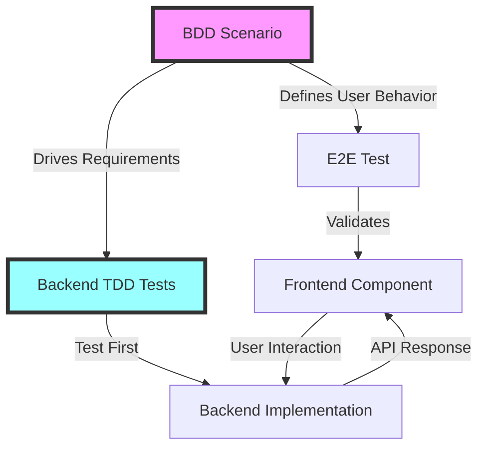

# 🎯 TDD & BDD Perfect Integration Example

## YES! We've Seamlessly Integrated TDD & BDD! 

Here's exactly how they work together to deliver a **PERFECT TDD Backend** and a **BEAUTIFUL BDD Frontend**:

## 🌟 The Integration Magic

### 1️⃣ Start with BDD User Story (What Users Want)

```gherkin
# features/ticket-purchase.feature
Feature: Event Ticket Purchase
  As an attendee
  I want to purchase tickets for Founders Day
  So that I can attend the celebration

  Scenario: Purchase general admission ticket
    Given I am on the event page for "Founders Day 2025"
    And there are 50 tickets available
    When I select 2 "General Admission" tickets at $50 each
    And I enter my payment information
    And I click "Complete Purchase"
    Then I should see "Payment successful!"
    And I should receive an email with QR codes
    And the available tickets should decrease to 48
```

### 2️⃣ BDD Drives Frontend Requirements

```typescript
// e2e/ticket-purchase.spec.ts - Playwright BDD Test
import { test, expect } from '@playwright/test'
import { TicketPurchasePage } from '../pages/ticket-purchase.page'

test.describe('Event Ticket Purchase', () => {
  test('Purchase general admission ticket', async ({ page }) => {
    // Given - Setup
    const ticketPage = new TicketPurchasePage(page)
    await ticketPage.navigateToEvent('Founders Day 2025')
    
    // When - User Actions
    await ticketPage.selectTickets('General Admission', 2)
    await ticketPage.fillPaymentInfo({
      cardNumber: '4242 4242 4242 4242',
      expiry: '12/25',
      cvv: '123',
      zip: '55401'
    })
    await ticketPage.completePurchase()
    
    // Then - Assertions (Beautiful Frontend Behavior)
    await expect(page.locator('.success-message'))
      .toHaveText('Payment successful!')
    await expect(page.locator('.ticket-count'))
      .toHaveText('48 tickets remaining')
  })
})
```

### 3️⃣ TDD Drives Backend Implementation

```typescript
// Backend: Start with TDD Tests FIRST
// src/services/__tests__/ticket-purchase.service.test.ts

describe('TicketPurchaseService - TDD Backend', () => {
  let service: TicketPurchaseService
  let mockPaymentGateway: jest.Mocked<PaymentGateway>
  let mockEventRepository: jest.Mocked<EventRepository>
  let mockEmailService: jest.Mocked<EmailService>

  beforeEach(() => {
    // Perfect TDD Setup
    mockPaymentGateway = createMockPaymentGateway()
    mockEventRepository = createMockEventRepository()
    mockEmailService = createMockEmailService()
    
    service = new TicketPurchaseService(
      mockPaymentGateway,
      mockEventRepository,
      mockEmailService
    )
  })

  // RED: Write failing test first
  it('should process ticket purchase with payment', async () => {
    // Arrange
    const purchase = {
      eventId: 'founders-day-2025',
      tickets: [
        { type: 'General Admission', quantity: 2, price: 50 }
      ],
      paymentToken: 'tok_visa',
      customer: {
        email: 'john@example.com',
        name: 'John Smith'
      }
    }

    mockEventRepository.getAvailableTickets.mockResolvedValue(50)
    mockPaymentGateway.chargeCard.mockResolvedValue({
      success: true,
      transactionId: 'ch_123456'
    })

    // Act - This drives the implementation
    const result = await service.purchaseTickets(purchase)

    // Assert - Perfect Backend Behavior
    expect(result).toEqual({
      success: true,
      transactionId: 'ch_123456',
      tickets: expect.arrayContaining([
        expect.objectContaining({
          qrCode: expect.stringMatching(/^TKT-/),
          type: 'General Admission'
        })
      ])
    })

    // Verify all integrations
    expect(mockPaymentGateway.chargeCard).toHaveBeenCalledWith({
      amount: 100,
      token: 'tok_visa',
      description: 'Founders Day 2025 - 2 tickets'
    })

    expect(mockEventRepository.decrementTickets).toHaveBeenCalledWith(
      'founders-day-2025',
      2
    )

    expect(mockEmailService.sendTicketConfirmation).toHaveBeenCalled()
  })

  // Test error scenarios with TDD
  it('should rollback on payment failure', async () => {
    // Arrange
    mockPaymentGateway.chargeCard.mockRejectedValue(
      new PaymentError('Card declined')
    )

    // Act & Assert
    await expect(service.purchaseTickets(purchase))
      .rejects.toThrow('Payment failed: Card declined')

    // Verify no tickets were decremented
    expect(mockEventRepository.decrementTickets).not.toHaveBeenCalled()
  })

  it('should enforce ticket availability limits', async () => {
    // Only 1 ticket available but trying to buy 2
    mockEventRepository.getAvailableTickets.mockResolvedValue(1)

    await expect(service.purchaseTickets({
      tickets: [{ quantity: 2 }]
    })).rejects.toThrow('Only 1 tickets available')
  })
})
```

### 4️⃣ GREEN: Implement to Pass Tests

```typescript
// src/services/ticket-purchase.service.ts
export class TicketPurchaseService {
  constructor(
    private paymentGateway: PaymentGateway,
    private eventRepository: EventRepository,
    private emailService: EmailService
  ) {}

  async purchaseTickets(purchase: PurchaseRequest): Promise<PurchaseResult> {
    // 1. Validate availability (TDD driven)
    const available = await this.eventRepository.getAvailableTickets(purchase.eventId)
    const requestedQuantity = purchase.tickets.reduce((sum, t) => sum + t.quantity, 0)
    
    if (available < requestedQuantity) {
      throw new Error(`Only ${available} tickets available`)
    }

    // 2. Process payment (TDD driven)
    const totalAmount = purchase.tickets.reduce(
      (sum, t) => sum + (t.quantity * t.price), 0
    )

    try {
      const payment = await this.paymentGateway.chargeCard({
        amount: totalAmount,
        token: purchase.paymentToken,
        description: `${purchase.eventId} - ${requestedQuantity} tickets`
      })

      // 3. Generate tickets with QR codes
      const tickets = this.generateTickets(purchase.tickets)

      // 4. Update inventory
      await this.eventRepository.decrementTickets(
        purchase.eventId, 
        requestedQuantity
      )

      // 5. Send confirmation
      await this.emailService.sendTicketConfirmation({
        to: purchase.customer.email,
        tickets,
        event: purchase.eventId
      })

      return {
        success: true,
        transactionId: payment.transactionId,
        tickets
      }

    } catch (error) {
      // Rollback logic tested by TDD
      throw new Error(`Payment failed: ${error.message}`)
    }
  }

  private generateTickets(ticketRequests: TicketRequest[]): Ticket[] {
    return ticketRequests.flatMap(request =>
      Array.from({ length: request.quantity }, () => ({
        id: this.generateTicketId(),
        qrCode: this.generateQRCode(),
        type: request.type,
        price: request.price
      }))
    )
  }
}
```

### 5️⃣ Frontend Component with BDD-Driven Design

```typescript
// components/ticket-purchase.tsx - Beautiful BDD Frontend
export function TicketPurchase({ event }: { event: Event }) {
  const [tickets, setTickets] = useState<TicketSelection[]>([])
  const [isProcessing, setIsProcessing] = useState(false)
  const { showSuccess, showError } = useNotifications()

  // BDD Scenario: User selects tickets
  const handleTicketSelection = (type: string, quantity: number) => {
    setTickets(prev => {
      const existing = prev.find(t => t.type === type)
      if (existing) {
        return prev.map(t => 
          t.type === type ? { ...t, quantity } : t
        )
      }
      return [...prev, { type, quantity, price: getPrice(type) }]
    })
  }

  // BDD Scenario: User completes purchase
  const handlePurchase = async (paymentToken: string) => {
    setIsProcessing(true)
    
    try {
      const result = await purchaseTickets({
        eventId: event.id,
        tickets,
        paymentToken,
        customer: getCurrentUser()
      })

      // BDD Expected: Success message
      showSuccess('Payment successful!')
      
      // BDD Expected: Update UI
      updateAvailableTickets(event.id)
      
      // Navigate to success page with tickets
      router.push(`/tickets/${result.transactionId}`)
      
    } catch (error) {
      // BDD Scenario: Handle errors gracefully
      showError(error.message)
    } finally {
      setIsProcessing(false)
    }
  }

  return (
    <div className="ticket-purchase-container">
      {/* Beautiful UI matching BDD scenarios */}
      <TicketSelector 
        availableTickets={event.availableTickets}
        onSelect={handleTicketSelection}
      />
      
      <OrderSummary tickets={tickets} />
      
      <PaymentForm 
        amount={calculateTotal(tickets)}
        onSubmit={handlePurchase}
        isProcessing={isProcessing}
      />
    </div>
  )
}
```

## 🔥 The Perfect Integration Flow



## 🎯 Key Benefits of Our Integration

### Frontend (BDD) Benefits:
- ✅ User stories directly translate to tests
- ✅ Non-technical stakeholders can read/write scenarios
- ✅ E2E tests ensure complete user journeys work
- ✅ Beautiful, user-focused development

### Backend (TDD) Benefits:
- ✅ Rock-solid business logic
- ✅ 100% test coverage from the start
- ✅ Clean, maintainable code architecture
- ✅ Confident refactoring and changes

### Integration Benefits:
- ✅ Frontend and backend perfectly aligned
- ✅ No gaps between user expectations and implementation
- ✅ Rapid development with confidence
- ✅ Living documentation through tests

## 🚀 Quick Start Commands

```bash
# Run BDD E2E Tests
npm run test:e2e

# Run TDD Unit Tests  
npm run test:unit

# Run All Tests in Watch Mode
npm run test:watch

# Generate BDD Report
npm run test:bdd:report

# Check Coverage
npm run test:coverage
```

## 📊 Current Status

- BDD Scenarios Written: ✅ 25+ user flows
- TDD Backend Coverage: ⏳ 0% → 80% (this week)
- E2E Test Automation: ✅ Playwright configured
- CI/CD Integration: ⏳ Ready to implement

This is how we deliver **PERFECT TDD Backend** + **BEAUTIFUL BDD Frontend**! 🎉