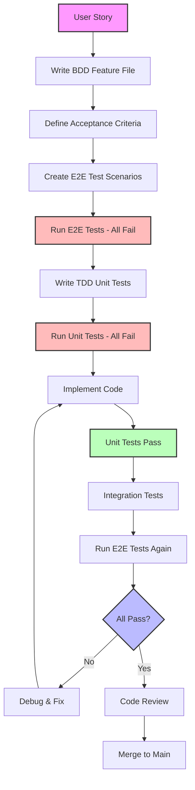

# TDD-BDD Integration Strategy for Founders Day Minnesota

## Table of Contents
1. [Overview: How TDD and BDD Complement Each Other](#overview)
2. [BDD for Frontend User Behaviors](#bdd-frontend)
3. [TDD for Backend API and Business Logic](#tdd-backend)
4. [Integration Between Both Approaches](#integration)
5. [Development Workflow](#workflow)
6. [Templates and Patterns](#templates)

## Overview: How TDD and BDD Complement Each Other {#overview}

### BDD (Behavior-Driven Development)
- **Focus**: What the system should do from the user's perspective
- **Language**: Natural language (Gherkin) that stakeholders understand
- **Scope**: User journeys, acceptance criteria, business value
- **Tools**: Cucumber, Playwright (with BDD plugins)

### TDD (Test-Driven Development)
- **Focus**: How the system should work at the code level
- **Language**: Programming language (TypeScript/JavaScript)
- **Scope**: Unit functionality, algorithms, data transformations
- **Tools**: Jest, Vitest, Testing Library

### The Synergy
```
BDD (User Story) → Acceptance Criteria → E2E Tests
                                    ↓
                        TDD Implementation Cycle
                                    ↓
                    Unit Tests → Code → Refactor
```

## BDD for Frontend User Behaviors {#bdd-frontend}

### Example 1: User Registration Feature

**Feature File: `features/user-registration.feature`**
```gherkin
Feature: User Registration
  As a Minnesota Freemason
  I want to register for Founders Day events
  So that I can participate in lodge activities

  Background:
    Given I am on the Founders Day Minnesota website
    And I am not logged in

  Scenario: Successful registration with valid information
    When I navigate to the registration page
    And I fill in the registration form with:
      | Field            | Value                    |
      | First Name       | John                     |
      | Last Name        | Smith                    |
      | Email            | john.smith@example.com   |
      | Phone            | 612-555-0123            |
      | Lodge Name       | Minneapolis Lodge #19    |
      | Lodge Number     | 19                       |
      | Member ID        | MN12345                  |
      | Password         | SecurePass123!           |
      | Confirm Password | SecurePass123!           |
    And I accept the terms and conditions
    And I click the "Register" button
    Then I should see a success message "Registration successful! Please check your email to verify your account."
    And I should receive a verification email at "john.smith@example.com"
    And my account should be created with status "pending_verification"

  Scenario: Registration fails with duplicate email
    Given a user already exists with email "john.smith@example.com"
    When I navigate to the registration page
    And I fill in the registration form with:
      | Field            | Value                    |
      | Email            | john.smith@example.com   |
      | Other Fields     | Valid Values             |
    And I click the "Register" button
    Then I should see an error message "An account with this email already exists"
    And the email field should be highlighted in red
    And I should remain on the registration page

  Scenario: Password validation
    When I navigate to the registration page
    And I enter "weak" in the password field
    Then I should see password requirements:
      """
      Password must contain:
      - At least 8 characters
      - One uppercase letter
      - One lowercase letter
      - One number
      - One special character
      """
    And the password strength indicator should show "Weak"

  @mobile
  Scenario: Mobile responsive registration
    Given I am using a mobile device
    When I navigate to the registration page
    Then the form should be displayed in a single column
    And all form fields should be easily tappable
    And the keyboard should automatically appear for the first field
```

### Example 2: Event Management Feature

**Feature File: `features/event-management.feature`**
```gherkin
Feature: Event Management
  As a Lodge Administrator
  I want to manage Founders Day events
  So that members can register and participate

  Background:
    Given I am logged in as a lodge administrator
    And I have permission to manage events for "Minneapolis Lodge #19"

  Scenario: Create a new Founders Day event
    When I navigate to the event management dashboard
    And I click "Create New Event"
    And I fill in the event details:
      | Field               | Value                                    |
      | Event Name          | Founders Day 2024 Celebration           |
      | Event Type          | Annual Banquet                          |
      | Date                | 2024-03-15                              |
      | Start Time          | 18:00                                   |
      | End Time            | 21:00                                   |
      | Venue               | Minneapolis Masonic Center              |
      | Address             | 123 Main St, Minneapolis, MN 55401      |
      | Capacity            | 150                                     |
      | Registration Opens  | 2024-02-01                              |
      | Registration Closes | 2024-03-10                              |
      | Member Price        | 50.00                                   |
      | Guest Price         | 65.00                                   |
      | Description         | Annual celebration of our founding      |
    And I upload an event banner image
    And I click "Save and Publish"
    Then I should see a success message "Event created successfully"
    And the event should appear in the events list with status "Published"
    And members should be able to see the event on the public calendar

  Scenario: Edit existing event with registrations
    Given an event "Spring Gathering" exists with 25 registrations
    When I edit the event details
    And I change the venue to "St. Paul Masonic Center"
    And I click "Save Changes"
    Then I should see a warning "This event has existing registrations. Attendees will be notified of changes."
    When I confirm the changes
    Then all 25 registered attendees should receive an email notification
    And the event history should show the venue change

  Scenario Outline: Event capacity management
    Given an event exists with capacity <capacity>
    And <registered> members are already registered
    When a member tries to register
    Then they should <result>
    And the available spots should show <available>

    Examples:
      | capacity | registered | result                         | available |
      | 100      | 50         | be able to register           | 49        |
      | 100      | 99         | be able to register           | 0         |
      | 100      | 100        | see "Event is full" message   | 0         |
      | 100      | 100        | be added to waitlist          | 0         |
```

## TDD for Backend API and Business Logic {#tdd-backend}

### Example 1: User Registration Service (TDD Approach)

**Test First: `user-registration.service.test.ts`**
```typescript
import { describe, it, expect, beforeEach, jest } from '@jest/globals';
import { UserRegistrationService } from '../services/user-registration.service';
import { UserRepository } from '../repositories/user.repository';
import { EmailService } from '../services/email.service';
import { LodgeService } from '../services/lodge.service';
import { PasswordService } from '../services/password.service';

describe('UserRegistrationService', () => {
  let service: UserRegistrationService;
  let userRepository: jest.Mocked<UserRepository>;
  let emailService: jest.Mocked<EmailService>;
  let lodgeService: jest.Mocked<LodgeService>;
  let passwordService: jest.Mocked<PasswordService>;

  beforeEach(() => {
    userRepository = {
      findByEmail: jest.fn(),
      create: jest.fn(),
      save: jest.fn(),
    };
    emailService = {
      sendVerificationEmail: jest.fn(),
    };
    lodgeService = {
      validateLodgeMembership: jest.fn(),
    };
    passwordService = {
      hash: jest.fn(),
      validateStrength: jest.fn(),
    };

    service = new UserRegistrationService(
      userRepository,
      emailService,
      lodgeService,
      passwordService
    );
  });

  describe('registerUser', () => {
    const validRegistrationData = {
      firstName: 'John',
      lastName: 'Smith',
      email: 'john.smith@example.com',
      phone: '612-555-0123',
      lodgeName: 'Minneapolis Lodge #19',
      lodgeNumber: 19,
      memberId: 'MN12345',
      password: 'SecurePass123!',
    };

    it('should successfully register a new user with valid data', async () => {
      // Arrange
      userRepository.findByEmail.mockResolvedValue(null);
      lodgeService.validateLodgeMembership.mockResolvedValue({
        isValid: true,
        lodge: { id: 'lodge-123', name: 'Minneapolis Lodge #19', number: 19 }
      });
      passwordService.validateStrength.mockReturnValue({
        isValid: true,
        score: 4,
        feedback: []
      });
      passwordService.hash.mockResolvedValue('hashed-password');
      userRepository.create.mockReturnValue({
        id: 'user-123',
        ...validRegistrationData,
        password: 'hashed-password',
        status: 'pending_verification',
        verificationToken: 'token-123'
      });

      // Act
      const result = await service.registerUser(validRegistrationData);

      // Assert
      expect(result.success).toBe(true);
      expect(result.user).toMatchObject({
        id: 'user-123',
        email: validRegistrationData.email,
        status: 'pending_verification'
      });
      expect(userRepository.findByEmail).toHaveBeenCalledWith(validRegistrationData.email);
      expect(lodgeService.validateLodgeMembership).toHaveBeenCalledWith({
        lodgeNumber: 19,
        memberId: 'MN12345'
      });
      expect(passwordService.hash).toHaveBeenCalledWith(validRegistrationData.password);
      expect(emailService.sendVerificationEmail).toHaveBeenCalledWith(
        validRegistrationData.email,
        expect.any(String)
      );
    });

    it('should fail when email already exists', async () => {
      // Arrange
      userRepository.findByEmail.mockResolvedValue({
        id: 'existing-user',
        email: validRegistrationData.email
      });

      // Act
      const result = await service.registerUser(validRegistrationData);

      // Assert
      expect(result.success).toBe(false);
      expect(result.error).toBe('An account with this email already exists');
      expect(userRepository.create).not.toHaveBeenCalled();
      expect(emailService.sendVerificationEmail).not.toHaveBeenCalled();
    });

    it('should fail when lodge membership is invalid', async () => {
      // Arrange
      userRepository.findByEmail.mockResolvedValue(null);
      lodgeService.validateLodgeMembership.mockResolvedValue({
        isValid: false,
        error: 'Member ID not found in lodge records'
      });

      // Act
      const result = await service.registerUser(validRegistrationData);

      // Assert
      expect(result.success).toBe(false);
      expect(result.error).toBe('Member ID not found in lodge records');
      expect(userRepository.create).not.toHaveBeenCalled();
    });

    it('should fail when password is too weak', async () => {
      // Arrange
      const weakPasswordData = { ...validRegistrationData, password: 'weak' };
      userRepository.findByEmail.mockResolvedValue(null);
      passwordService.validateStrength.mockReturnValue({
        isValid: false,
        score: 1,
        feedback: ['Password must be at least 8 characters', 'Add uppercase letters']
      });

      // Act
      const result = await service.registerUser(weakPasswordData);

      // Assert
      expect(result.success).toBe(false);
      expect(result.error).toBe('Password does not meet security requirements');
      expect(result.passwordFeedback).toEqual([
        'Password must be at least 8 characters',
        'Add uppercase letters'
      ]);
    });
  });
});
```

**Implementation: `user-registration.service.ts`**
```typescript
export class UserRegistrationService {
  constructor(
    private userRepository: UserRepository,
    private emailService: EmailService,
    private lodgeService: LodgeService,
    private passwordService: PasswordService
  ) {}

  async registerUser(data: RegistrationData): Promise<RegistrationResult> {
    // Check if email already exists
    const existingUser = await this.userRepository.findByEmail(data.email);
    if (existingUser) {
      return {
        success: false,
        error: 'An account with this email already exists'
      };
    }

    // Validate password strength
    const passwordValidation = this.passwordService.validateStrength(data.password);
    if (!passwordValidation.isValid) {
      return {
        success: false,
        error: 'Password does not meet security requirements',
        passwordFeedback: passwordValidation.feedback
      };
    }

    // Validate lodge membership
    const membershipValidation = await this.lodgeService.validateLodgeMembership({
      lodgeNumber: data.lodgeNumber,
      memberId: data.memberId
    });
    if (!membershipValidation.isValid) {
      return {
        success: false,
        error: membershipValidation.error
      };
    }

    // Create user
    const hashedPassword = await this.passwordService.hash(data.password);
    const verificationToken = this.generateVerificationToken();
    
    const user = await this.userRepository.create({
      ...data,
      password: hashedPassword,
      status: 'pending_verification',
      verificationToken,
      lodgeId: membershipValidation.lodge.id
    });

    await this.userRepository.save(user);

    // Send verification email
    await this.emailService.sendVerificationEmail(user.email, verificationToken);

    return {
      success: true,
      user: {
        id: user.id,
        email: user.email,
        status: user.status
      }
    };
  }

  private generateVerificationToken(): string {
    return crypto.randomBytes(32).toString('hex');
  }
}
```

### Example 2: Event Capacity Management (TDD Approach)

**Test First: `event-capacity.service.test.ts`**
```typescript
import { describe, it, expect, beforeEach } from '@jest/globals';
import { EventCapacityService } from '../services/event-capacity.service';
import { Event, Registration } from '../types';

describe('EventCapacityService', () => {
  let service: EventCapacityService;

  beforeEach(() => {
    service = new EventCapacityService();
  });

  describe('checkAvailability', () => {
    it('should return available spots when event has capacity', () => {
      const event: Event = {
        id: 'event-1',
        capacity: 100,
        registrations: Array(50).fill({}) as Registration[]
      };

      const result = service.checkAvailability(event);

      expect(result).toEqual({
        isAvailable: true,
        totalCapacity: 100,
        registered: 50,
        available: 50,
        waitlistActive: false
      });
    });

    it('should handle full events correctly', () => {
      const event: Event = {
        id: 'event-1',
        capacity: 100,
        registrations: Array(100).fill({}) as Registration[]
      };

      const result = service.checkAvailability(event);

      expect(result).toEqual({
        isAvailable: false,
        totalCapacity: 100,
        registered: 100,
        available: 0,
        waitlistActive: true
      });
    });

    it('should handle unlimited capacity events', () => {
      const event: Event = {
        id: 'event-1',
        capacity: null, // unlimited
        registrations: Array(500).fill({}) as Registration[]
      };

      const result = service.checkAvailability(event);

      expect(result).toEqual({
        isAvailable: true,
        totalCapacity: null,
        registered: 500,
        available: null,
        waitlistActive: false
      });
    });
  });

  describe('canRegisterGuests', () => {
    it('should allow guests when enough capacity exists', () => {
      const event: Event = {
        id: 'event-1',
        capacity: 100,
        registrations: Array(50).fill({}) as Registration[],
        maxGuestsPerMember: 3
      };

      const result = service.canRegisterGuests(event, 2);

      expect(result).toEqual({
        allowed: true,
        reason: null,
        availableGuestSpots: 3
      });
    });

    it('should prevent guests when insufficient capacity', () => {
      const event: Event = {
        id: 'event-1',
        capacity: 100,
        registrations: Array(99).fill({}) as Registration[],
        maxGuestsPerMember: 3
      };

      const result = service.canRegisterGuests(event, 2);

      expect(result).toEqual({
        allowed: false,
        reason: 'Not enough capacity for 2 guests. Only 1 spot available.',
        availableGuestSpots: 0
      });
    });

    it('should enforce guest limit per member', () => {
      const event: Event = {
        id: 'event-1',
        capacity: 100,
        registrations: Array(50).fill({}) as Registration[],
        maxGuestsPerMember: 3
      };

      const result = service.canRegisterGuests(event, 5);

      expect(result).toEqual({
        allowed: false,
        reason: 'Maximum 3 guests allowed per member',
        availableGuestSpots: 3
      });
    });
  });
});
```

## Integration Between Both Approaches {#integration}

### Connecting BDD Scenarios to TDD Implementation

**Step Definition: `step-definitions/registration.steps.ts`**
```typescript
import { Given, When, Then } from '@cucumber/cucumber';
import { expect } from '@playwright/test';
import { RegistrationPage } from '../pages/registration.page';
import { DatabaseHelper } from '../helpers/database.helper';
import { EmailHelper } from '../helpers/email.helper';

const registrationPage = new RegistrationPage();
const dbHelper = new DatabaseHelper();
const emailHelper = new EmailHelper();

Given('I am on the Founders Day Minnesota website', async function() {
  await this.page.goto('/');
  await expect(this.page).toHaveTitle('Founders Day Minnesota');
});

Given('I am not logged in', async function() {
  const authCookie = await this.context.cookies();
  const hasAuth = authCookie.some(cookie => cookie.name === 'auth-token');
  expect(hasAuth).toBe(false);
});

Given('a user already exists with email {string}', async function(email: string) {
  await dbHelper.createUser({
    email,
    firstName: 'Existing',
    lastName: 'User',
    status: 'active'
  });
});

When('I navigate to the registration page', async function() {
  await this.page.click('text=Register');
  await expect(this.page).toHaveURL('/register');
});

When('I fill in the registration form with:', async function(dataTable) {
  const formData = dataTable.rowsHash();
  
  for (const [field, value] of Object.entries(formData)) {
    if (field === 'Other Fields') continue;
    
    const fieldMap = {
      'First Name': 'firstName',
      'Last Name': 'lastName',
      'Email': 'email',
      'Phone': 'phone',
      'Lodge Name': 'lodgeName',
      'Lodge Number': 'lodgeNumber',
      'Member ID': 'memberId',
      'Password': 'password',
      'Confirm Password': 'confirmPassword'
    };
    
    const fieldName = fieldMap[field] || field;
    await registrationPage.fillField(fieldName, value);
  }
});

When('I accept the terms and conditions', async function() {
  await this.page.check('input[name="acceptTerms"]');
});

When('I click the {string} button', async function(buttonText: string) {
  await this.page.click(`button:has-text("${buttonText}")`);
});

Then('I should see a success message {string}', async function(message: string) {
  await expect(this.page.locator('.alert-success')).toContainText(message);
});

Then('I should receive a verification email at {string}', async function(email: string) {
  // Wait for email to be sent (in test environment)
  await this.page.waitForTimeout(2000);
  
  const emails = await emailHelper.getEmailsFor(email);
  const verificationEmail = emails.find(e => 
    e.subject.includes('Verify your account')
  );
  
  expect(verificationEmail).toBeDefined();
  expect(verificationEmail.body).toContain('verification link');
});

Then('my account should be created with status {string}', async function(status: string) {
  const user = await dbHelper.findUserByEmail(this.testData.email);
  expect(user).toBeDefined();
  expect(user.status).toBe(status);
});

Then('I should see an error message {string}', async function(message: string) {
  await expect(this.page.locator('.alert-error')).toContainText(message);
});

Then('the email field should be highlighted in red', async function() {
  const emailField = this.page.locator('input[name="email"]');
  await expect(emailField).toHaveClass(/error|invalid/);
  const borderColor = await emailField.evaluate(el => 
    window.getComputedStyle(el).borderColor
  );
  expect(borderColor).toContain('rgb(239, 68, 68)'); // red color
});
```

### Playwright E2E Tests Implementing BDD Scenarios

**E2E Test: `e2e/registration.spec.ts`**
```typescript
import { test, expect } from '@playwright/test';
import { RegistrationPage } from '../pages/registration.page';
import { DatabaseHelper } from '../helpers/database.helper';
import { EmailHelper } from '../helpers/email.helper';

test.describe('User Registration - BDD Scenarios', () => {
  let registrationPage: RegistrationPage;
  let dbHelper: DatabaseHelper;
  let emailHelper: EmailHelper;

  test.beforeEach(async ({ page }) => {
    registrationPage = new RegistrationPage(page);
    dbHelper = new DatabaseHelper();
    emailHelper = new EmailHelper();
    
    // Clean up test data
    await dbHelper.cleanTestData();
    await emailHelper.clearTestEmails();
    
    await page.goto('/');
  });

  test('Successful registration with valid information', async ({ page }) => {
    // Given I am on the registration page
    await page.click('text=Register');
    await expect(page).toHaveURL('/register');
    
    // When I fill in the registration form
    await registrationPage.fillRegistrationForm({
      firstName: 'John',
      lastName: 'Smith',
      email: 'john.smith@example.com',
      phone: '612-555-0123',
      lodgeName: 'Minneapolis Lodge #19',
      lodgeNumber: '19',
      memberId: 'MN12345',
      password: 'SecurePass123!',
      confirmPassword: 'SecurePass123!'
    });
    
    // And I accept terms and submit
    await page.check('input[name="acceptTerms"]');
    await page.click('button:has-text("Register")');
    
    // Then I should see success message
    await expect(page.locator('.alert-success')).toContainText(
      'Registration successful! Please check your email to verify your account.'
    );
    
    // And email should be sent
    await page.waitForTimeout(2000); // Wait for async email
    const emails = await emailHelper.getEmailsFor('john.smith@example.com');
    expect(emails).toHaveLength(1);
    expect(emails[0].subject).toBe('Verify your Founders Day Minnesota account');
    
    // And user should be created in database
    const user = await dbHelper.findUserByEmail('john.smith@example.com');
    expect(user).toBeDefined();
    expect(user.status).toBe('pending_verification');
    expect(user.lodgeNumber).toBe(19);
  });

  test('Registration fails with duplicate email', async ({ page }) => {
    // Given a user already exists
    await dbHelper.createUser({
      email: 'john.smith@example.com',
      firstName: 'Existing',
      lastName: 'User',
      status: 'active'
    });
    
    // When I try to register with same email
    await page.click('text=Register');
    await registrationPage.fillRegistrationForm({
      firstName: 'John',
      lastName: 'Smith',
      email: 'john.smith@example.com',
      // ... other fields
    });
    await page.click('button:has-text("Register")');
    
    // Then I should see error message
    await expect(page.locator('.alert-error')).toContainText(
      'An account with this email already exists'
    );
    
    // And email field should be highlighted
    const emailField = page.locator('input[name="email"]');
    await expect(emailField).toHaveClass(/error/);
    
    // And no new user should be created
    const users = await dbHelper.findAllUsersByEmail('john.smith@example.com');
    expect(users).toHaveLength(1); // Only the original user
  });

  test('Password validation provides real-time feedback', async ({ page }) => {
    await page.goto('/register');
    
    // When I enter a weak password
    const passwordField = page.locator('input[name="password"]');
    await passwordField.fill('weak');
    
    // Then I should see validation feedback
    await expect(page.locator('.password-requirements')).toBeVisible();
    await expect(page.locator('.requirement-length')).toHaveClass(/invalid/);
    await expect(page.locator('.requirement-uppercase')).toHaveClass(/invalid/);
    await expect(page.locator('.requirement-number')).toHaveClass(/invalid/);
    await expect(page.locator('.requirement-special')).toHaveClass(/invalid/);
    
    // And strength indicator should show weak
    await expect(page.locator('.password-strength')).toHaveText('Weak');
    await expect(page.locator('.strength-bar')).toHaveClass(/weak/);
    
    // When I enter a strong password
    await passwordField.fill('SecurePass123!');
    
    // Then all requirements should be met
    await expect(page.locator('.requirement-length')).toHaveClass(/valid/);
    await expect(page.locator('.requirement-uppercase')).toHaveClass(/valid/);
    await expect(page.locator('.requirement-number')).toHaveClass(/valid/);
    await expect(page.locator('.requirement-special')).toHaveClass(/valid/);
    
    // And strength indicator should show strong
    await expect(page.locator('.password-strength')).toHaveText('Strong');
    await expect(page.locator('.strength-bar')).toHaveClass(/strong/);
  });

  test('Mobile responsive registration form', async ({ page, browserName }) => {
    // Set mobile viewport
    await page.setViewportSize({ width: 375, height: 667 });
    
    await page.goto('/register');
    
    // Then form should be in single column
    const formFields = await page.locator('.form-field').all();
    const fieldPositions = await Promise.all(
      formFields.map(field => field.boundingBox())
    );
    
    // All fields should have same x position (single column)
    const xPositions = fieldPositions.map(pos => pos?.x || 0);
    const uniqueXPositions = [...new Set(xPositions)];
    expect(uniqueXPositions).toHaveLength(1);
    
    // Fields should be easily tappable (minimum 44px height)
    for (const position of fieldPositions) {
      expect(position?.height || 0).toBeGreaterThanOrEqual(44);
    }
    
    // First field should be focused (mobile keyboard helper)
    await expect(page.locator('input[name="firstName"]')).toBeFocused();
  });
});
```

## Development Workflow {#workflow}

### Integrated TDD-BDD Workflow



### Workflow Steps

1. **Start with BDD (User Perspective)**
   ```bash
   # Create feature file for user story
   npm run bdd:create-feature -- user-registration
   
   # Write scenarios in Gherkin
   # Review with stakeholders
   ```

2. **Generate Step Definitions**
   ```bash
   # Generate step definition stubs
   npm run bdd:generate-steps -- features/user-registration.feature
   
   # Implement step definitions
   ```

3. **Run BDD Tests (Should Fail)**
   ```bash
   # Run Cucumber tests
   npm run test:bdd
   
   # All scenarios should fail (no implementation yet)
   ```

4. **Switch to TDD (Developer Perspective)**
   ```bash
   # Create unit test file
   npm run tdd:create-test -- user-registration.service
   
   # Write failing tests first
   npm run test:unit -- --watch
   ```

5. **Implement Code (Make Tests Pass)**
   ```bash
   # Implement service/component
   # Run tests continuously
   npm run test:unit -- --watch
   
   # Refactor as needed
   ```

6. **Integration Testing**
   ```bash
   # Run integration tests
   npm run test:integration
   
   # Fix any integration issues
   ```

7. **Verify BDD Scenarios Pass**
   ```bash
   # Run E2E tests
   npm run test:e2e
   
   # All BDD scenarios should now pass
   ```

8. **Continuous Integration**
   ```yaml
   # .github/workflows/test.yml
   name: TDD-BDD Test Suite
   
   on: [push, pull_request]
   
   jobs:
     test:
       runs-on: ubuntu-latest
       steps:
         - uses: actions/checkout@v3
         
         - name: Setup Node.js
           uses: actions/setup-node@v3
           with:
             node-version: '18'
             
         - name: Install dependencies
           run: npm ci
           
         - name: Run Unit Tests (TDD)
           run: npm run test:unit -- --coverage
           
         - name: Run Integration Tests
           run: npm run test:integration
           
         - name: Run E2E Tests (BDD)
           run: npm run test:e2e
           
         - name: Upload Coverage
           uses: codecov/codecov-action@v3
   ```

## Templates and Patterns {#templates}

### BDD Feature Template

**Template: `templates/feature.template.feature`**
```gherkin
Feature: [Feature Name]
  As a [user role]
  I want to [action/goal]
  So that [benefit/value]

  # Optional: Background for common setup
  Background:
    Given [common precondition]
    And [another common precondition]

  # Happy path scenario
  Scenario: [Successful primary action]
    Given [initial context]
    When [user action]
    And [additional action]
    Then [expected outcome]
    And [additional verification]

  # Error handling scenario
  Scenario: [Error case description]
    Given [initial context]
    And [condition that will cause error]
    When [user action that triggers error]
    Then [error should be handled gracefully]
    And [user should see helpful message]

  # Edge case scenario
  Scenario: [Edge case description]
    Given [unusual but valid context]
    When [user action]
    Then [system should handle correctly]

  # Data-driven scenario
  Scenario Outline: [Parameterized test description]
    Given [context with <parameter>]
    When [action with <input>]
    Then [result should be <output>]

    Examples:
      | parameter | input | output |
      | value1    | data1 | result1 |
      | value2    | data2 | result2 |

  # Tagged scenarios for specific test runs
  @smoke @critical
  Scenario: [Critical functionality]
    Given [minimal setup]
    When [core action]
    Then [core functionality works]

  @mobile
  Scenario: [Mobile-specific behavior]
    Given [mobile context]
    When [mobile interaction]
    Then [mobile-optimized result]
```

### TDD Test Template

**Template: `templates/service.test.template.ts`**
```typescript
import { describe, it, expect, beforeEach, afterEach, jest } from '@jest/globals';
import { [ServiceName] } from '../services/[service-name].service';
import { [Dependencies] } from '../[dependencies]';

describe('[ServiceName]', () => {
  let service: [ServiceName];
  let mockDependency: jest.Mocked<[DependencyType]>;

  beforeEach(() => {
    // Setup mocks
    mockDependency = {
      methodName: jest.fn(),
      // ... other methods
    };

    // Initialize service with mocks
    service = new [ServiceName](mockDependency);

    // Common setup
  });

  afterEach(() => {
    // Cleanup
    jest.clearAllMocks();
  });

  describe('[methodName]', () => {
    // Happy path tests
    describe('successful operations', () => {
      it('should [expected behavior] when [condition]', async () => {
        // Arrange
        const input = { /* test data */ };
        const expectedOutput = { /* expected result */ };
        mockDependency.methodName.mockResolvedValue(/* mock return */);

        // Act
        const result = await service.methodName(input);

        // Assert
        expect(result).toEqual(expectedOutput);
        expect(mockDependency.methodName).toHaveBeenCalledWith(/* expected args */);
        expect(mockDependency.methodName).toHaveBeenCalledTimes(1);
      });

      it('should [another expected behavior]', async () => {
        // Test implementation
      });
    });

    // Error cases
    describe('error handling', () => {
      it('should throw [ErrorType] when [error condition]', async () => {
        // Arrange
        mockDependency.methodName.mockRejectedValue(new Error('Dependency failed'));

        // Act & Assert
        await expect(service.methodName(/* input */))
          .rejects
          .toThrow('[Expected error message]');
      });

      it('should return error result when [validation fails]', async () => {
        // Arrange
        const invalidInput = { /* invalid data */ };

        // Act
        const result = await service.methodName(invalidInput);

        // Assert
        expect(result.success).toBe(false);
        expect(result.error).toBe('[Expected error message]');
      });
    });

    // Edge cases
    describe('edge cases', () => {
      it('should handle empty input gracefully', async () => {
        // Test implementation
      });

      it('should handle maximum values correctly', async () => {
        // Test implementation
      });
    });

    // Performance tests (if applicable)
    describe('performance', () => {
      it('should complete within 100ms for typical input', async () => {
        const start = Date.now();
        await service.methodName(/* typical input */);
        const duration = Date.now() - start;
        
        expect(duration).toBeLessThan(100);
      });
    });
  });
});
```

### Page Object Template for E2E Tests

**Template: `templates/page.template.ts`**
```typescript
import { Page, Locator } from '@playwright/test';

export class [PageName]Page {
  readonly page: Page;
  
  // Define locators
  readonly pageTitle: Locator;
  readonly submitButton: Locator;
  readonly errorMessage: Locator;
  readonly successMessage: Locator;
  
  // Form fields (if applicable)
  readonly fieldName: Locator;
  
  constructor(page: Page) {
    this.page = page;
    
    // Initialize locators
    this.pageTitle = page.locator('h1');
    this.submitButton = page.locator('button[type="submit"]');
    this.errorMessage = page.locator('.alert-error');
    this.successMessage = page.locator('.alert-success');
    
    // Form fields
    this.fieldName = page.locator('input[name="fieldName"]');
  }
  
  // Navigation methods
  async goto() {
    await this.page.goto('/[page-route]');
    await this.page.waitForLoadState('networkidle');
  }
  
  // Action methods
  async fillForm(data: [FormDataType]) {
    await this.fieldName.fill(data.fieldName);
    // ... fill other fields
  }
  
  async submitForm() {
    await this.submitButton.click();
  }
  
  // Assertion helper methods
  async expectSuccessMessage(message: string) {
    await expect(this.successMessage).toBeVisible();
    await expect(this.successMessage).toContainText(message);
  }
  
  async expectErrorMessage(message: string) {
    await expect(this.errorMessage).toBeVisible();
    await expect(this.errorMessage).toContainText(message);
  }
  
  // Complex interaction methods
  async completeWorkflow(data: [WorkflowDataType]) {
    await this.fillForm(data.formData);
    await this.submitForm();
    await this.page.waitForResponse(response => 
      response.url().includes('/api/[endpoint]') && 
      response.status() === 200
    );
  }
}
```

### Test Data Builder Pattern

**Template: `templates/test-data-builder.template.ts`**
```typescript
export class [EntityName]TestDataBuilder {
  private data: Partial<[EntityType]>;

  constructor() {
    // Set default valid data
    this.data = {
      id: 'test-id-' + Date.now(),
      name: 'Test [Entity]',
      status: 'active',
      createdAt: new Date(),
      // ... other default fields
    };
  }

  // Fluent builder methods
  withId(id: string): this {
    this.data.id = id;
    return this;
  }

  withName(name: string): this {
    this.data.name = name;
    return this;
  }

  withStatus(status: [StatusType]): this {
    this.data.status = status;
    return this;
  }

  // Preset builders for common scenarios
  asInvalid(): this {
    this.data = {
      ...this.data,
      // Set fields that make entity invalid
    };
    return this;
  }

  asExpired(): this {
    this.data = {
      ...this.data,
      status: 'expired',
      expiresAt: new Date(Date.now() - 24 * 60 * 60 * 1000) // yesterday
    };
    return this;
  }

  // Build method
  build(): [EntityType] {
    return this.data as [EntityType];
  }

  // Build multiple
  buildMany(count: number): [EntityType][] {
    return Array.from({ length: count }, (_, i) => ({
      ...this.build(),
      id: `${this.data.id}-${i}`
    }));
  }
}

// Usage in tests:
// const user = new UserTestDataBuilder()
//   .withName('John Doe')
//   .withStatus('pending')
//   .build();
```

### Command Pattern for Complex Test Actions

**Template: `templates/test-command.template.ts`**
```typescript
export interface TestCommand<T> {
  execute(): Promise<T>;
  undo?(): Promise<void>;
}

export class [Action]Command implements TestCommand<[ReturnType]> {
  constructor(
    private readonly context: TestContext,
    private readonly params: [ParamsType]
  ) {}

  async execute(): Promise<[ReturnType]> {
    // Perform the action
    const result = await this.context.[action](this.params);
    
    // Store state for potential undo
    this.context.commandHistory.push({
      command: this.constructor.name,
      params: this.params,
      result
    });
    
    return result;
  }

  async undo(): Promise<void> {
    // Implement undo logic
    await this.context.[undoAction](this.params);
  }
}

// Composite command for complex scenarios
export class [Workflow]Command implements TestCommand<[ReturnType]> {
  private subCommands: TestCommand<any>[] = [];

  constructor(context: TestContext) {
    // Build command sequence
    this.subCommands = [
      new [Step1]Command(context, { /* params */ }),
      new [Step2]Command(context, { /* params */ }),
      new [Step3]Command(context, { /* params */ })
    ];
  }

  async execute(): Promise<[ReturnType]> {
    const results = [];
    
    for (const command of this.subCommands) {
      try {
        const result = await command.execute();
        results.push(result);
      } catch (error) {
        // Rollback on failure
        await this.rollback(results.length - 1);
        throw error;
      }
    }
    
    return this.aggregateResults(results);
  }

  private async rollback(toIndex: number) {
    for (let i = toIndex; i >= 0; i--) {
      await this.subCommands[i].undo?.();
    }
  }
}
```

## Summary

This TDD-BDD integration strategy provides:

1. **Clear Separation of Concerns**
   - BDD captures user requirements and behaviors
   - TDD ensures implementation correctness

2. **Comprehensive Test Coverage**
   - User journeys validated through BDD
   - Code logic verified through TDD
   - Integration points tested at both levels

3. **Team Collaboration**
   - BDD features readable by all stakeholders
   - TDD tests document technical implementation
   - Clear workflow connects both approaches

4. **Quality Assurance**
   - Automated testing at all levels
   - Continuous verification of requirements
   - Fast feedback loops

5. **Maintainability**
   - Templates ensure consistency
   - Patterns promote best practices
   - Documentation through tests

By following this integrated approach, the Founders Day Minnesota team can ensure high-quality software that meets user needs while maintaining technical excellence.